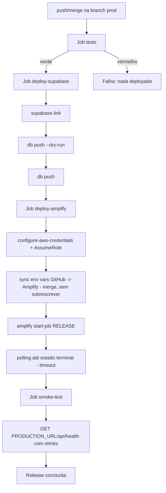

# Sprint Change Proposal — Pipeline de CI/CD de Produção (GitHub Actions + Supabase Cloud + AWS Amplify)

- **Data:** 2026-08-08
- **Autor:** Amelia (Developer, correct-course)
- **Modo:** Batch
- **Status:** Proposta aguardando aprovação
- **Classificação de escopo:** Moderada (reorganização de backlog: novo épico + stories; emendas em NFR/arquitetura; novos artefatos de infra)

---

## Seção 1 — Resumo do problema (Issue Summary)

### Gatilho
O usuário solicitou introduzir uma **pipeline de CI/CD de produção completa**, orquestrada pelo **GitHub Actions**, disparada por merge/push na branch `prod`, com a sequência de gates:

```
tests → deploy-supabase → deploy-amplify → smoke-test
```

usando **Supabase Cloud (Free)** para migrations e **AWS Amplify Hosting** para o app Next.js.

### Categoria
Novo requisito emergente / mudança estratégica de infraestrutura — **não** é falha de implementação de uma story específica. Surgiu ao operacionalizar o deploy de produção.

### Evidência (estado atual da codebase)

| Item | Estado encontrado |
|---|---|
| Package manager | **npm** (`package-lock.json`) |
| Framework | **Next.js 16.2.6** (App Router) + React 19 + Tailwind 4 + Turbopack |
| Tipo de app | **SSR** — 24 rotas em `app/api/*` + middleware `proxy.ts`. **Não** é static export |
| Comando de teste | `npm test` → `node --test "tests/unit/**/*.test.mjs" && npm run test:dynamic` (tsx) — real e existente |
| Estado dos testes | **Estava VERMELHO** (2 falhas: Story 1.5 e 1.6). Ver §4-A |
| Supabase | Cloud, project-ref `lygkwhcwsrxfozswhxyo`; `supabase/migrations/` com **1 baseline** (`20260728015653_remote_schema.sql`) |
| Amplify | **Sem `amplify.yml`** versionado |
| GitHub Actions | **Nenhum workflow** (`.github/` ausente) |
| Health check | **Inexistente** |
| Env públicas | `NEXT_PUBLIC_SUPABASE_URL`, `NEXT_PUBLIC_SUPABASE_PUBLISHABLE_KEY`, `NEXT_PUBLIC_APP_URL` |
| Env secretas (server) | `SUPABASE_SECRET_KEY`, `ISSUER_PRIVATE_KEY`, `WEBHOOK_SIGNING_PRIVATE_KEY`, `BLOCKCHAIN_WALLET_PRIVATE_KEY`, `BLOCKCHAIN_CONTRACT_ADDRESS`, `BLOCKCHAIN_RPC_URL`, `OCR_API_URL`, `OCR_API_KEY`, `YAID_VERIFICATION_BASE_URL`, `STAGE` |

---

## Seção 2 — Análise de impacto (Impact Analysis)

### 2.1 Conflito arquitetural central (o mais importante)

O plano documentado hoje **contradiz** o desenho pedido:

- `architecture.md` (Infraestrutura & Deploy, linha ~237): *"CI/CD: GitHub Actions (lint + typecheck) + **Amplify (build + deploy automático)**"*
- `epics.md` NFR11 (linha ~127): *"Deploy em AWS Amplify; CI/CD via GitHub Actions (**lint + typecheck**)"*

Ou seja, o plano atual assume **Amplify auto-build** no push, com GitHub Actions só validando. O pedido inverte o modelo: **GitHub Actions vira o orquestrador** do release e o **auto-build do Amplify é desabilitado** para evitar dois deploys concorrentes.

**Menor alteração arquitetural necessária:** emendar NFR11 + FR34 + a seção "Infraestrutura & Deploy" para o modelo orquestrado, sem tocar nas demais decisões (stack, camadas, Supabase, ethers etc. permanecem intocados).

### 2.2 Impacto por Epic

| Epic | Impacto |
|---|---|
| Epics 1–10 | **Nenhum impacto funcional.** Nenhum épico existente é invalidado, resequenciado ou removido. |
| Epic 7 (Story 7.1 — Migrations) | **Fundação reaproveitada.** A pipeline consome o diretório `supabase/migrations/` já estabelecido pela Story 7.1 (`done`). Sem alteração de escopo. |
| **Novo Epic 11** | **Adicionado** — "Pipeline de CI/CD de Produção" (ver §4-C). |

### 2.3 Impacto por Story

- **Nenhuma story existente muda de escopo funcional.**
- **Ajuste técnico já aplicado (aprovado pelo usuário — "opção 2"):** 2 testes das Stories 1.5/1.6 foram atualizados de `window.location.href` para `router.push`, para alinhar com o código atual das telas de login/cadastro e **destravar o gate `tests`** (sem o quê o primeiro release falharia). Ver §4-A.

### 2.4 Conflitos de artefato

| Artefato | Precisa mudar? | O quê |
|---|---|---|
| `epics.md` (NFR11, FR34) | **Sim** | Expandir descrição de CI/CD; adicionar Epic 11 |
| `architecture.md` (Infra & Deploy) | **Sim** | Reescrever para modelo orquestrado + expand/contract + IAM assume-role + health |
| PRD | **Não** (opcional) | Núcleo e MVP intactos. Pode-se adicionar 1 nota em "Estado de implementação". Não obrigatório. |
| UX design | **Não** | Zero impacto de UI. |
| `sprint-status.yaml` | **Sim** | Adicionar `epic-11` + stories como `backlog` |

### 2.5 Impacto técnico / novos artefatos (a implementar após aprovação)

1. `app/api/health/route.ts` — health check público e leve.
2. `amplify.yml` — build spec SSR versionado.
3. `.github/workflows/production.yml` — a pipeline.
4. `docs/deployment/production-cicd.md` — documentação operacional (arquitetura, jobs, IAM, custom domain, migrations, rollback, troubleshooting).
5. Ajuste em `src/shared/middleware.ts` — liberar `/api/health` como rota pública (senão o middleware de sessão pode interferir).

---

## Seção 3 — Abordagem recomendada (Recommended Approach)

**Opção escolhida: Direct Adjustment (Opção 1) + emenda de arquitetura.**

- **Direct Adjustment:** adicionar **Epic 11** com stories dentro da estrutura existente; nenhum épico existente é tocado. Emendar NFR11/FR34 e a seção de Infra da arquitetura.
- **Rollback (Opção 2): descartado.** Não há trabalho concluído que precise ser revertido (o ajuste dos testes é forward-fix, não rollback).
- **MVP Review (Opção 3): descartado.** O MVP não encolhe nem muda; isto é infraestrutura de entrega, aditiva.

| Critério | Avaliação |
|---|---|
| Esforço | **Médio** — 1 workflow, 1 health endpoint, 1 amplify.yml, docs, + setup manual de infra (one-time). |
| Risco técnico | **Médio** — mitigado por `db push --dry-run`, gates sequenciais, IAM least-privilege, polling com timeout, expand→contract. |
| Impacto no cronograma | **Baixo** — não bloqueia nenhuma story funcional em andamento. |
| Sustentabilidade | **Alta** — pipeline determinística, auditável e versionada. |

### Desenho-alvo



---

## Seção 4 — Propostas de mudança detalhadas (Detailed Change Proposals)

### 4-A. Testes (já aplicado, aprovado pelo usuário)

```
Story: 1.5 (tests/unit/story-1-5/signup-atomico.test.mjs)
OLD: assert.match(src, /window\.location\.href\s*=\s*["']\/["']/, "...force full reload...")
NEW: assert.match(src, /router\.push\(["']\/["']\)/, "...router.push('/')...")

Story: 1.6 (tests/unit/story-1-6/login-e-protecao-de-rotas.test.mjs)
OLD: assert.match(src, /window\.location\.href/, "...force full page reload...")
NEW: assert.match(src, /router\.push\(safePath\)/, "...router.push(safePath)...")
```
**Racional:** os commits de UI trocaram o redirect para `router.push`; os testes ficaram desatualizados. Alinhados ao código atual. **Resultado:** `npm test` → 648+10 passam, 0 falham (gate destravado).

### 4-B. `architecture.md` — Infraestrutura & Deploy

```
OLD (linha ~237):
- **CI/CD:** GitHub Actions (lint + typecheck) + Amplify (build + deploy automático).

NEW:
- **CI/CD (produção):** GitHub Actions é o ORQUESTRADOR do release na branch `prod`.
  Gates sequenciais (needs): tests → deploy-supabase → deploy-amplify → smoke-test.
  O auto-build do Amplify na branch `prod` é DESABILITADO (enableAutoBuild=false) para
  evitar deploy duplicado; a integração GitHub↔Amplify é preservada para o Amplify buscar
  o código. Migrations aplicadas via Supabase CLI (`db push`) ANTES do deploy do app,
  seguindo expand→deploy→contract. Autenticação AWS via IAM User bootstrap → sts:AssumeRole
  → IAM Role de deploy (OIDC indisponível). Validação pós-deploy via GET /api/health.
```
**Racional:** resolve o conflito §2.1; documenta o modelo orquestrado.

### 4-C. `epics.md` — NFR11, FR34 e novo Epic 11

**NFR11 (linha ~127):**
```
OLD: NFR11: Deploy em AWS Amplify; CI/CD via GitHub Actions (lint + typecheck).
NEW: NFR11: Deploy em AWS Amplify (app SSR/Web Compute). O release de produção é
     orquestrado pelo GitHub Actions na branch `prod` com gates sequenciais
     tests → deploy-supabase → deploy-amplify → smoke-test; auto-build do Amplify
     desabilitado na branch prod. Lint/typecheck permanecem como validação (o build
     Next.js no Amplify executa o typecheck).
```

**FR34 (linha ~103):** manter texto; acrescentar nota:
```
+ Nota (2026-08-08): além do `db diff --check` opcional no PR, o release em `prod`
+ aplica migrations pendentes via `supabase db push` (precedido de `--dry-run`) como
+ primeiro passo de infra da pipeline, antes do deploy do app.
```

**Novo item na "Epic List":**
```
### Epic 11: Pipeline de CI/CD de Produção

Todo merge/push em `prod` dispara um release determinístico e auditável orquestrado
pelo GitHub Actions: roda os testes unitários como gate, aplica migrations pendentes
no Supabase Cloud (dry-run antes do push), publica o app no Amplify via start-job
RELEASE (com auto-build desabilitado), aguarda o deployment em estado terminal e valida
a aplicação por health check. Inclui autenticação AWS por AssumeRole (least-privilege),
sincronização segura de env vars e documentação operacional (IAM, custom domain,
bootstrap vs release, rollback).

**FRs cobertos:** nenhum (infraestrutura de entrega / operação) — decorre de NFR11.
```

### 4-D. Estrutura distribuída da pipeline (decisão do usuário)

O usuário optou por uma pipeline **distribuída**: cada job vive em um arquivo próprio dentro de
`.github/jobs/`, e o `production.yml` apenas os **orquestra/chama**.

**Restrição do GitHub Actions:** *reusable workflows* só podem ficar em `.github/workflows/`
(subpastas não são suportadas). Portanto a distribuição em `.github/jobs/` é feita com
**composite actions** (`.github/jobs/<nome>/action.yml`), que podem morar em qualquer pasta e são
chamadas por `uses: ./.github/jobs/<nome>`. Trade-off: composite actions recebem secrets via
`with:` (inputs) a partir do orquestrador — os secrets ficam centralizados no `production.yml`,
nunca hardcoded.

```
.github/
├── jobs/
│   ├── tests/action.yml
│   ├── deploy-supabase/action.yml
│   ├── deploy-amplify/action.yml
│   └── smoke-test/action.yml
└── workflows/
    └── production.yml        # 4 jobs finos (needs encadeados) que chamam os de .github/jobs/
```

### Stories propostas do Epic 11

| Story | Título | Entrega |
|---|---|---|
| 11.1 | Health check `/api/health` | `app/api/health/route.ts` público (`{status:"ok"}`), `force-dynamic`, sem DB/secrets; whitelisting em `middleware.ts` |
| 11.2 | `amplify.yml` SSR + desabilitar auto-build | `amplify.yml` versionado (`npm ci` + `next build`, `baseDirectory: .next`); doc para `enableAutoBuild=false` na branch prod |
| 11.3 | Composite `tests` + orquestrador base | `.github/jobs/tests/action.yml` (Node 22 → `npm ci` → `npm test`) + `production.yml` com trigger em `prod` e job `tests` |
| 11.4 | Composite `deploy-supabase` | `.github/jobs/deploy-supabase/action.yml` (setup CLI → `link` → `db push --dry-run` → `db push`); job `deploy-supabase` (needs: tests) |
| 11.5 | Composite `deploy-amplify` | `.github/jobs/deploy-amplify/action.yml` (AssumeRole → sync env merge → `start-job RELEASE` → polling c/ timeout); job (needs: deploy-supabase) |
| 11.6 | Composite `smoke-test` | `.github/jobs/smoke-test/action.yml` (`GET $PRODUCTION_URL/api/health` com retries); job (needs: deploy-amplify) |
| 11.7 | Documentação operacional | `docs/deployment/production-cicd.md` + IAM policies + custom domain + rollback |

### 4-E. `sprint-status.yaml`

```
+  # Epic 11: Pipeline de CI/CD de Produção (Sprint Change 2026-08-08)
+  epic-11: backlog
+  11-1-health-check-endpoint: backlog
+  11-2-amplify-yml-e-desabilitar-auto-build: backlog
+  11-3-workflow-job-tests: backlog
+  11-4-workflow-job-deploy-supabase: backlog
+  11-5-workflow-job-deploy-amplify: backlog
+  11-6-workflow-job-smoke-test: backlog
+  11-7-documentacao-operacional: backlog
+  epic-11-retrospective: optional
```

---

## Seção 5 — Riscos técnicos e decisões-chave (para a implementação)

1. **Node no CI:** `node --test "tests/unit/**/*.test.mjs"` só expande o glob `**` a partir do **Node 21+**. **Fixar Node 22 (LTS)** no workflow; Node 18/20 quebraria a coleta de testes.
2. **App é SSR:** `amplify.yml` e o Amplify App precisam ser Next.js **Web Compute** (`baseDirectory: .next`), não static export.
3. **`STAGE=PROD` exige env obrigatórias:** `environments.ts` valida no boot `ISSUER_PRIVATE_KEY`, `WEBHOOK_SIGNING_PRIVATE_KEY`, `BLOCKCHAIN_WALLET_PRIVATE_KEY`, `BLOCKCHAIN_CONTRACT_ADDRESS` quando `STAGE=PROD`. Todas devem existir no Amplify (secrets server-side), senão a app quebra no boot.
4. **Sync de env vars sem sobrescrever:** `aws amplify update-branch --environment-variables` **substitui o mapa inteiro**. A pipeline deve **ler as vars atuais, mesclar e reenviar** — nunca sobrescrever cegamente. Secrets server-side **nunca** viram `NEXT_PUBLIC_*`; nada de secret nos logs.
5. **Segurança de migrations (expand→contract):** o baseline `20260728015653_remote_schema.sql` é um dump de `db pull` (contém `DROP EXTENSION IF EXISTS pg_net`) — já refletido no remoto, então `db push` deve ser no-op. Futuras migrations destrutivas (`DROP COLUMN`) só depois que a app publicada deixar de depender da estrutura antiga.
6. **Health x middleware:** `middleware.ts` intercepta `/api/*`; `/api/health` precisa entrar em `isPublicApiRoute` para ser realmente público.
7. **IAM least-privilege:** bootstrap só `sts:AssumeRole`; role só com `amplify:StartJob/GetJob/GetBranch/UpdateBranch/ListJobs` no ARN do app. Sem `AdministratorAccess`, sem `Action:"*"/Resource:"*"`.
8. **Polling finito:** timeout/max tentativas no wait do Amplify e nos retries do smoke-test; falha explícita em estado não-`SUCCEED`.

---

## Seção 6 — Plano de handoff (Implementation Handoff)

**Classificação:** Moderada → Product Owner / Developer.

| Passo | Responsável | Tipo |
|---|---|---|
| Aprovar esta proposta | Usuário (Victordegasperi) | Decisão |
| Aplicar emendas em `epics.md`, `architecture.md`, `sprint-status.yaml` | Developer | Backlog/docs |
| Implementar 11.1–11.7 (workflow, health, amplify.yml, docs) | Developer | Código/infra |
| Setup one-time de infra (Supabase link, Amplify app, IAM, GitHub Environment, domínio, DNS, desabilitar auto-build) | Usuário (com doc gerada) | Infra manual |

### Critérios de sucesso
- `npm test` verde no gate `tests`.
- `deploy-supabase` aplica só migrations pendentes (dry-run antes).
- `deploy-amplify` só roda após Supabase; smoke-test só após Amplify `SUCCEED`.
- `GET /api/health` retorna 200 `{status:"ok"}`.
- Nenhum secret versionado; IAM auditado por least-privilege.

### Separação bootstrap vs release

```mermaid
flowchart LR
    subgraph ONCE [Uma única vez - setup manual]
      S1[Supabase project + link]
      S2[Amplify app + conectar GitHub]
      S3[branch prod + desabilitar auto-build]
      S4[IAM bootstrap + deploy role]
      S5[GitHub Environment secrets/vars]
      S6[Custom domain + DNS + SSL]
    end
    subgraph EACH [A cada release - automático]
      R1[tests]
      R2[db push --dry-run + db push]
      R3[AssumeRole + sync env]
      R4[Amplify start-job RELEASE + wait]
      R5[smoke test /api/health]
    end
    ONCE -.pré-requisito.-> EACH
```



---

## Checklist de navegação da mudança (resultado)

| Seção | Item | Status |
|---|---|---|
| 1. Trigger e contexto | 1.1 story gatilho / 1.2 problema / 1.3 evidência | [x] / [x] / [x] |
| 2. Impacto em Epic | 2.1–2.5 | [x] (Epics 1–10 intactos; +Epic 11) |
| 3. Conflito de artefatos | 3.1 PRD / 3.2 Arch / 3.3 UX / 3.4 outros (CI/CD, IaC) | [N/A] / [!] / [N/A] / [!] |
| 4. Caminho | 4.1 Direct Adjustment | [Viável — escolhido] |
|  | 4.2 Rollback / 4.3 MVP Review | [Não viável] / [Não viável] |
| 5. Componentes da proposta | 5.1–5.5 | [x] |
| 6. Revisão e handoff | 6.1–6.5 | [x] exceto 6.3 (aprovação) e 6.4 (aplicar) pendentes |
