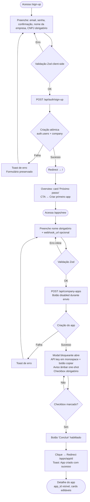
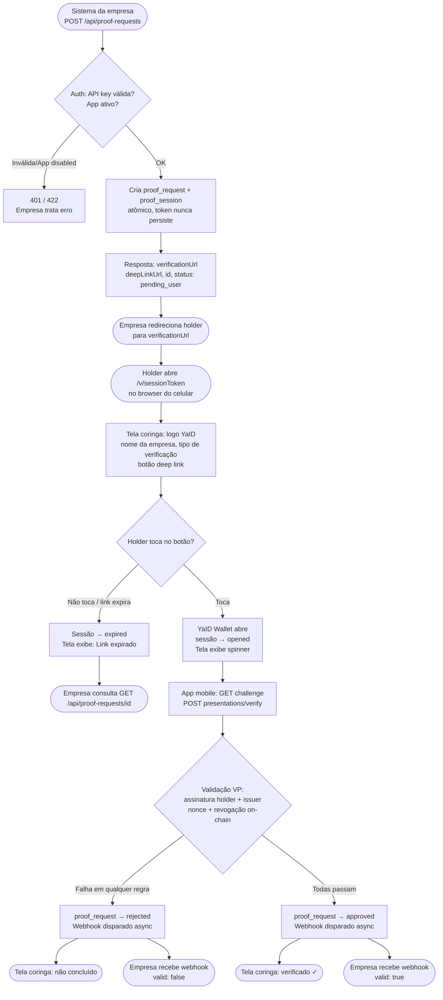
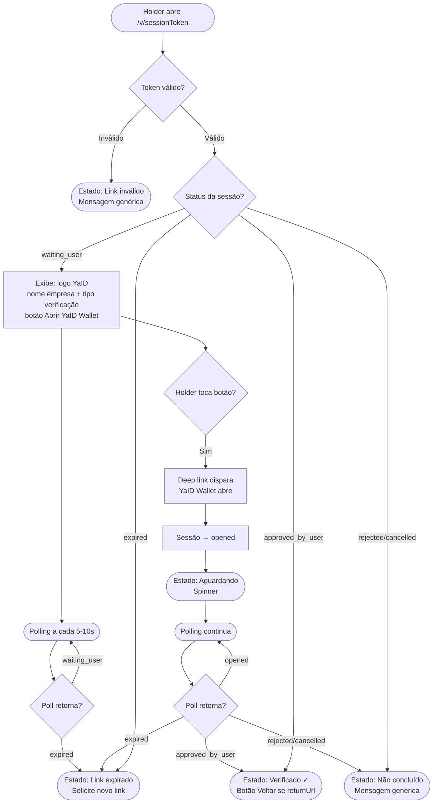

# UX Design Specification — yaid_dashboard

**Author:** Victordegasperi
**Date:** 2026-05-12
**Última revisão:** 2026-07-27 (Sprint Change Proposal — marca oficial, topbar dinâmica, ambiente por app, review manual em homologação, remoção da Resposta da API)

---

<!-- UX design content will be appended sequentially through collaborative workflow steps -->

## Executive Summary

### Project Vision

O yaid_dashboard é a interface central da plataforma YaID de identidade auto-soberana (SSI).
Entrega simultaneamente um dashboard B2B para empresas parceiras gerenciarem sua integração
de verificação de identidade, e uma tela coringa pública que guia o holder pelo fluxo de
verificação no browser — tudo em uma única codebase Next.js.

A proposta de valor central é: a empresa parceira nunca vê documento, VC ou VP; recebe apenas
`valid: true | false`. O holder nunca entrega PII a terceiros; assina uma prova criptográfica
no app mobile. A YaID não armazena nenhum dado pessoal do holder.

### Target Users

**Empresa Parceira (usuário primário do dashboard)**
Desenvolvedor ou gestor técnico de empresa que precisa validar identidade de seus usuários.
É tech-savvy, opera Desktop-first, lida com APIs, webhooks e API keys. Quer integração
simples e confiável sem precisar entender SSI ou blockchain. Sua métrica de sucesso é
receber `valid: true | false` via webhook sem ver dados pessoais.

**Holder (usuário da tela coringa)**
Usuário final da empresa parceira, que recebe um link para verificar sua identidade.
Pode ser qualquer pessoa, potencialmente não-técnica, no celular. O contato com a YaID
é pontual e guiado: o holder chegou até a tela seguindo um fluxo da empresa parceira,
vê a marca YaID e toca num botão para abrir o app instalado no seu dispositivo.
Não há pressão de tempo — a experiência é calma, focada em clareza e confiança.
Não sabe — e não precisa saber — o que é DID, VC ou VP.

### Key Design Challenges

1. **Modal de API Key One-Shot**: Comunicar urgência real ("salve agora, não haverá segunda
   chance") sem criar pânico. Modal bloqueante por design — ESC e clique fora não fecham;
   checkbox obrigatório bloqueia conclusão.

2. **Tela Coringa — Clareza e Confiança, não Urgência**: A experiência do holder é calma
   e guiada. O desafio é apresentar a marca YaID de forma confiável, explicar em linguagem
   natural o que está acontecendo, e deixar o botão de abertura do app como ação óbvia e
   sem fricção. Os 6 estados (waiting_user, opened, approved, rejected/cancelled, expired,
   inválida) precisam ser auto-explicativos sem pressionar o usuário.

3. **Abstração Completa de SSI**: Vocabulário técnico (DID, VC, VP, blockchain) não pode
   aparecer na interface. Todo conceito precisa de tradução para linguagem natural em PT-BR.

4. **Signup Atômico sem Onboarding**: Um formulário único cria conta + empresa. Não há
   estados intermediários. Formulário precisa ser completo mas simples.

5. **Estados Vazios com Sentido**: Empresa recém-cadastrada vê tudo vazio. Cada listagem
   vazia precisa de CTA que guie a próxima ação, não apenas informar ausência de dados.

### Design Opportunities

1. **Privacidade como Diferencial Visível**: A ausência de armazenamento de PII é uma
   feature ativa. Privacy cards e avisos institucionais constroem confiança genuína.

2. **Onboarding Progressivo via Overview**: O card "próximo passo recomendado" pode ser
   o guia de integração da empresa — do primeiro app à primeira proof request com webhook.

3. **Cópia como Primeira Ação**: API key, app_id, verification_url — botões de cópia
   consistentes e feedback "Copiado!" reduzem fricção operacional em todo o dashboard.

## Core User Experience

### Defining Experience

O yaid_dashboard entrega duas experiências centrais distintas, cada uma com sua ação definidora:

**Dashboard (Empresa Parceira):** A experiência central é "criar o primeiro app e copiar a
API key". É o momento de passagem entre empresa cadastrada e empresa integradora. Tudo antes
(signup) é pré-requisito; tudo depois (proof requests, webhooks, métricas) é consequência.
O sucesso definitivo acontece quando a empresa recebe o primeiro `valid: true` via webhook.

**Tela Coringa (Holder):** A experiência central é um único toque — abrir o YaID Wallet.
A tela existe como ponto de transição entre o browser da empresa parceira e o app do holder.
Seu papel é completo quando o holder entende o que precisa fazer e toca no botão com confiança.

### Platform Strategy

**Dashboard:** Web, Desktop-first. Interface mouse/keyboard, sidebar fixa, layout com
max-w-7xl centralizado. Mobile funcional mas não otimizado — a empresa parceira opera
primariamente em ambiente de trabalho.

**Tela Coringa:** Web, mobile-first. Container centralizado ~520px, otimizado para toque.
O holder chega pelo celular, seguindo um link da empresa parceira. O botão de deep link é
a ação primária e deve ocupar posição de destaque visual.

### Effortless Interactions

- **Cópia sem fricção:** API key, app_id e verification_url são strings que o usuário
  precisa copiar. Botões de cópia inline com feedback "Copiado!" eliminam seleção manual
  em todo o dashboard.
- **Signup → Dashboard imediato:** Formulário único sem onboarding. Empresa preenche,
  submete e já está no dashboard com company criada — sem etapas intermediárias.
- **Um toque na tela coringa:** O holder não precisa entender o que é um deep link, DID
  ou VC. Vê a marca YaID, entende que precisa usar o app, toca no botão. Pronto.
- **Toast automático em toda submissão:** Sucesso e erro sempre comunicados via Sonner,
  sem que o usuário precise procurar feedback visual.

### Critical Success Moments

**Dashboard:**
1. **Primeiro app criado + API key copiada** — empresa sai do cadastro com tudo que precisa
   para integrar. O modal one-shot é o momento mais crítico a acertar.
2. **Primeiro proof request aprovado** — empresa vê `approved` no dashboard ou recebe
   webhook com `valid: true`. Prova que a integração funciona ponta a ponta.

**Tela Coringa:**
1. **Holder toca no botão e o app abre** — transição bem-sucedida do browser para o
   YaID Wallet. Se o app não estiver instalado, a mensagem deve orientar sem frustrar.
2. **Tela exibe `approved`** — holder sabe que a verificação foi concluída e pode
   voltar ao fluxo da empresa parceira.

### Experience Principles

1. **Abstração total de SSI:** Nenhum termo técnico (DID, VC, VP, blockchain, nonce)
   aparece na interface. Toda tecnologia é invisível; só o resultado importa.

2. **Confiança visível:** Privacidade não é ausência de algo — é uma mensagem ativa.
   O sistema comunica explicitamente que não armazena dados pessoais, gerando confiança
   tanto na empresa parceira quanto no holder.

3. **Um passo de cada vez:** Signup atômico, modal one-shot, tela coringa com ação única.
   Cada tela tem uma decisão principal. Complexidade fica no backend, não na interface.

4. **Cópia como cidadã de primeira classe:** Strings operacionais (API keys, IDs, URLs)
   são sempre apresentadas com botão de cópia. Copiar é a ação, não o texto selecionável.

5. **Estados vazios que ensinam:** Listagens vazias não informam ausência — orientam a
   próxima ação. O dashboard guia a empresa pela sua jornada de integração.

## Desired Emotional Response

### Primary Emotional Goals

**Empresa Parceira — Confiança Operacional**
A emoção central do dashboard é a confiança de quem integrou uma API séria e sabe que
ela vai funcionar. Não é animação nem deslumbramento — é a tranquilidade de ter o processo
sob controle: a API key está segura, os proof requests chegam, o webhook dispara.

**Holder — Segurança e Clareza**
A emoção central da tela coringa é a segurança de quem chegou num lugar legítimo, entende
o que está sendo pedido e sabe que o processo é simples. O holder não escolheu a YaID —
chegou até ali por um link de outra empresa. A tela precisa ganhar confiança em segundos.

### Emotional Journey Mapping

**Empresa Parceira:**
- **Cadastro:** Alívio — um formulário, sem etapas adicionais, já estou dentro.
- **Criação do app + API key:** Segurança — copiei, confirmei, não vou perder acesso.
- **Primeira proof request:** Curiosidade controlada — vou testar se funciona.
- **Primeiro `valid: true`:** Confiança consolidada — integração real, funciona ponta a ponta.
- **Uso recorrente:** Eficiência — sei onde estão as coisas, o que preciso está a um clique.
- **Algo dá errado:** Clareza sem pânico — mensagem de erro diz o que aconteceu, não me deixa sem norte.

**Holder:**
- **Abre o link:** Neutralidade + curiosidade — o que é esse site?
- **Vê a tela coringa:** Reconhecimento — YaID, logotipo, linguagem clara. Parece legítimo.
- **Lê o que é pedido:** Compreensão — entendo o que vai acontecer, sem jargão técnico.
- **Toca no botão:** Confiança — sei o que estou fazendo.
- **Vê `approved`:** Alívio e conclusão — feito. Posso voltar ao que estava fazendo.
- **Sessão expirada ou rejeitada:** Clareza sem culpa — entendo o que aconteceu, sei o que fazer.

### Micro-Emotions

**Emoções a cultivar:**
- **Confiança** — o sistema é sério, seguro e previsível.
- **Clareza** — sei o que está acontecendo e o que fazer a seguir.
- **Eficiência** — cheguei onde precisava sem fricção.
- **Alívio** — não preciso me preocupar com o que acontece com meus dados.

**Emoções a evitar:**
- **Ansiedade com segurança** — empresa não pode sentir que a API key pode vazar ou que o sistema é frágil.
- **Desconfiança** — holder não pode sentir que está entregando dados que não quer, ou que está sendo rastreado.
- **Confusão** — nenhum usuário pode ficar sem saber o que fazer a seguir em qualquer estado da interface.
- **Sensação de vigilância** — a ausência de armazenamento de PII deve ser comunicada ativamente, não apenas assumida.

### Design Implications

- **Confiança → Linguagem direta e sem jargão:** Títulos e mensagens dizem exatamente o que acontece, sem eufemismos ou tecnicismos.
- **Segurança → Privacy cards e avisos institucionais visíveis:** A mensagem "não armazenamos seus dados" aparece nos momentos certos, não escondida em rodapé.
- **Clareza → Estados sempre comunicados:** Loading, erro, vazio, sucesso — cada estado tem mensagem e ação associada. Nunca tela em branco ou spinner infinito sem contexto.
- **Eficiência → Hierarquia visual clara:** A ação principal de cada tela tem destaque visual inequívoco. Ações secundárias não competem com a principal.
- **Alívio → Confirmação explícita de sucesso:** Toast, mensagem na tela, badge de status — o sistema sempre confirma que a ação foi concluída com sucesso.

### Emotional Design Principles

1. **Ganhe confiança antes de pedir ação:** Na tela coringa, a marca YaID e a explicação em linguagem natural vêm antes do botão. O holder confia, depois age.

2. **Erros são informativos, não alarmantes:** Mensagens de erro dizem o que aconteceu e o que fazer — nunca apenas "algo deu errado". Tom calmo, não técnico.

3. **Privacidade é dita, não apenas praticada:** O sistema não armazena PII — isso é comunicado explicitamente nos momentos de maior dúvida do usuário.

4. **O vazio não é um estado neutro:** Listagens vazias e estados iniciais são oportunidades de orientar e encorajar, não apenas informar ausência.

## UX Pattern Analysis & Inspiration

### Inspiring Products Analysis

**Dashboard Empresarial — Referência: Supabase Dashboard (paleta azul e branco)**

O Supabase Dashboard é uma referência direta: interface orientada a tabelas, sidebar
lateral com hierarquia clara, linguagem técnica sem ser intimidadora, e excelente uso
de estados vazios com CTAs que ensinam. O que diferencia o yaid_dashboard é a paleta
azul e branco (ao invés do verde Supabase), reforçando a identidade corporativa e a
seriedade de um sistema de controle empresarial.

Padrões que funcionam no Supabase e se aplicam diretamente:
- Sidebar fixa com seções bem rotuladas e sem sobrecarga cognitiva
- Tabelas limpas com badges de status coloridos e IDs legíveis (truncados com tooltip)
- Blocos de código/strings com botão de cópia inline
- Modais para ações críticas e confirmações
- Empty states com ilustração simples + CTA direto
- Cards de configuração organizados por contexto (não por formulário único gigante)
- Toasts discretos de feedback (bottom-right, auto-dismiss)

**Tela Coringa — Referência: Páginas de deep link / redirecionamento de app**

A tela coringa é uma "ponte mínima" — não é um destino, é um corredor. Referências
análogas: tela de QR code do WhatsApp Web (propósito único, sem navegação, instrução
clara), banners de abertura de app (smart app banners do iOS/Android), telas de
consentimento OAuth (marca visível, ação única, linguagem direta).

O que essas referências fazem bem:
- Marca dominante e imediatamente reconhecível
- Uma frase explicativa, sem parágrafos
- Um botão único em destaque total
- Nenhuma navegação, nenhum menu, nenhuma distração

### Transferable UX Patterns

**Padrões de Navegação:**
- **Sidebar fixa com seções rotuladas** — Apps, Proof Requests, Settings. Hierarquia
  plana, sem submenus no MVP.
- **Breadcrumb + back link em páginas de detalhe** — usuário sabe onde está e como
  voltar sem depender do browser.

**Padrões de Interação:**
- **Cópia inline com feedback imediato** — botão de cópia ao lado de qualquer string
  operacional (API key, app_id, verification_url). Ícone de clipboard → ícone de check
  por 2 segundos.
- **Modal bloqueante para ação one-shot** — API key revelada uma única vez: sem ESC,
  sem clique-fora, checkbox obrigatório antes do botão de conclusão. Padrão similar
  ao reveal de recovery codes do GitHub/GitLab.
- **Toggle de status com confirmação seletiva** — desabilitar pede confirmação;
  reabilitar não pede. Mesma lógica do Supabase para ações com impacto assimétrico.
- **Botão único em destaque na tela coringa** — sem competição visual, sem scroll
  necessário. O botão de abrir o app é a tela inteira.

**Padrões Visuais:**
- **Paleta azul e branco** — transmite seriedade corporativa e confiança institucional.
  Status colors: azul para informação, verde para aprovado/ativo, vermelho para
  rejeitado/erro, amarelo/âmbar para pendente, cinza para expirado/desabilitado.
- **Badges de status com cor semântica consistente** — mesmo badge, mesma cor, em toda
  a aplicação. Empresa aprende uma vez, reconhece para sempre.
- **Cards de configuração segmentados** — formulários divididos em cards por contexto
  (ex: card "Identificação" + card "Webhook") ao invés de um formulário único longo.
- **PageHeader padronizado** — título, descrição e ações sempre na mesma posição.
  Usuário sabe onde olhar em qualquer tela.

### Anti-Patterns to Avoid

- **Countdown timer agressivo na tela coringa** — cria pressão desnecessária. A sessão
  expira no backend; a tela não precisa urgencializar o holder.
- **Modal dismissível acidentalmente** — para API key one-shot, ESC e clique fora não
  fecham. Qualquer outro modal pode ser dispensado normalmente.
- **Múltiplas ações primárias competindo** — cada tela tem uma ação principal.
  Ações secundárias (editar, desabilitar) são menos proeminentes visualmente.
- **Status badges sem padrão de cor** — se "active" é verde em apps e azul em
  proof_requests, o usuário aprende duas vezes. Cores semânticas são globais.
- **Mensagem de erro genérica** — "Algo deu errado" não orienta. Cada erro tem
  mensagem específica e, quando possível, ação corretiva.
- **Tela coringa com texto longo** — o holder não vai ler parágrafos. Uma frase
  explicativa é o limite.

### Design Inspiration Strategy

**Adotar diretamente:**
- Layout geral do Supabase: sidebar fixa + topbar + main com max-w centralizado
- Tabelas com badges de status, IDs truncados, ações contextuais
- Empty states com CTA — cada listagem vazia guia a próxima ação
- Cópia inline em todas as strings operacionais

**Adaptar para o contexto:**
- Paleta: substituir verde Supabase por azul institucional + branco
- Modal de API key: mais restritivo que padrões comuns (sem ESC, sem clique-fora)
  pela natureza one-shot da revelação
- Tela coringa: mais minimalista que qualquer referência — uma tela, uma ação,
  marca YaID dominante, sem QR code no MVP

**Evitar:**
- Qualquer elemento que crie urgência artificial na tela coringa
- Formulários longos sem segmentação em cards
- Ações destrutivas sem confirmação explícita

## Design System Foundation

### Design System Choice

**shadcn/ui sobre Tailwind CSS 4** — componentes headless e acessíveis, copiados
diretamente para o projeto (sem dependência de pacote externo). Complementa os
componentes custom já existentes no projeto.

Stack de design consolidado:
- **Tailwind CSS 4** — estilização utilitária (já instalado)
- **shadcn/ui** — componentes base (Dialog, Table, Badge, Select, Toggle, etc.)
- **Radix UI** — primitivos de acessibilidade (dependência do shadcn/ui)
- **Lucide React** — ícones (já instalado)
- **Sonner** — toasts (já instalado, bottom-right global)
- **clsx + tailwind-merge** — composição de classes (já instalado)

### Rationale for Selection

1. **Compatibilidade nativa com Tailwind CSS 4** — sem conflitos de estilo, sem
   override wars. O projeto já usa Tailwind; shadcn/ui é Tailwind-first.

2. **Componentes críticos prontos e acessíveis** — Dialog (modal de API key one-shot),
   Select (formulários de criação), Toggle (status de app), Table (listagens), Badge
   (status), todos com acessibilidade via Radix UI sem implementação manual.

3. **Propriedade do código** — componentes são copiados para o projeto, não importados
   de pacote. Podem ser modificados livremente sem depender de versões externas.

4. **Themeable via CSS variables** — paleta azul e branco configurada em `globals.css`
   como variáveis CSS. Um único ponto de controle para toda a identidade visual.

5. **Preserva componentes existentes** — `MetricCard`, `StatusBadge`, `PageHeader`,
   `CodeBlock` continuam como estão. shadcn/ui complementa onde não há componente custom.

### Implementation Approach

**Componentes shadcn/ui a instalar prioritariamente:**
- `Dialog` — modal bloqueante de API key one-shot
- `Table` — listagens de apps e proof requests
- `Badge` — status semântico (substituindo ou integrando ao StatusBadge existente)
- `Select` — formulários de criação (app, proof request helper)
- `Switch` — toggle de status do app
- `Card` — cards de configuração segmentados
- `Checkbox` — confirmação no modal de API key
- `Alert` — avisos institucionais e mensagens de privacidade
- `Separator` — divisores de seção

**Componentes que permanecem custom:**
- `MetricCard` — já implementado, mantido
- `PageHeader` — já implementado, mantido
- `CodeBlock` / `InlineCode` — já implementado, mantido
- `StatusBadge` — avaliar integração com Badge do shadcn/ui na implementação

### Customization Strategy

**Paleta azul e branco via CSS variables em `globals.css`:**
- Primary: azul institucional (tons de blue-600 a blue-800)
- Background: branco puro / gray-50 para superfícies secundárias
- Status colors semânticas globais:
  - Aprovado/Ativo: green
  - Rejeitado/Erro: red
  - Pendente/Processing: amber
  - Expirado/Desabilitado: gray
  - Informação: blue

**Tipografia:** herança do Next.js / Tailwind defaults — sem fonte customizada no MVP.

**Border radius:** moderado (rounded-md padrão do shadcn/ui) — transmite seriedade
sem ser rígido demais.

**Densidade:** compacta para tabelas (dados operacionais), confortável para formulários
e detalhes. Mesma lógica do Supabase Dashboard.

## Defining Core Experience

### Defining Experience

**Dashboard — "Do cadastro à API key em mãos, em menos de 2 minutos"**
A empresa se cadastra, cai direto no dashboard, cria o primeiro app e sai do modal
com a API key copiada e pronta para integrar. É o momento de passagem de "cadastrada"
para "integradora". Se esse fluxo for fluído e seguro, tudo que vem depois é consequência.

**Tela Coringa — "Abrir o link, reconhecer a YaID, tocar no botão"**
O holder abre o link no celular, vê a marca YaID com uma frase clara, e toca no botão
para abrir o app. Três momentos: reconhecimento → compreensão → ação. Sem fricção,
sem explicação adicional necessária.

### User Mental Model

**Empresa Parceira:**
Pensa em termos de API keys, endpoints, webhooks e requests/responses. Tem familiaridade
com ferramentas como Stripe, Twilio e Supabase — espera criar um app, receber credenciais
e começar a chamar a API. Não quer aprender SSI; quer integrar. O modal de API key
one-shot é familiar (GitHub, GitLab, Supabase fazem o mesmo); o que diferencia aqui
é o checkbox obrigatório que força confirmação antes de fechar.

**Holder:**
Não tem modelo mental prévio sobre a YaID. Recebeu um link de uma empresa que confia
e quer completar uma etapa de verificação. Pensa: "preciso usar meu app para isso".
A tela coringa deve confirmar esse modelo — não desafiá-lo.

### Success Criteria

**Dashboard:**
- Usuário completa signup sem abandonar o formulário
- Modal de API key abre imediatamente após criação do app
- API key é copiada antes de fechar o modal
- Checkbox marcado → botão "Concluir" habilitado → clique → redirect para `/apps/[appId]`
- Na página de detalhe do app, usuário vê o app configurado e pronto para uso

**Tela Coringa:**
- Holder vê a marca YaID e identifica como legítima em menos de 3 segundos
- Frase explicativa comunica o que acontece sem usar jargão técnico
- Holder toca no botão e o YaID Wallet abre
- Após verificação no app, a tela exibe `approved` sem ação adicional do holder

### Novel vs. Established Patterns

**Dashboard — Padrões estabelecidos com variante mais restritiva:**
O reveal de API key one-shot é um padrão conhecido (GitHub, Supabase, Stripe fazem o
mesmo). A variante do yaid_dashboard é mais restritiva: sem ESC, sem clique fora,
checkbox obrigatório antes do botão de conclusão. Essa restrição adicional não precisa
de educação — o próprio modal explica por que ("Esta é a única vez que sua API key
será exibida").

**Tela Coringa — Padrão estabelecido adaptado para SSI:**
Smart app banners e telas de redirecionamento para app são padrões conhecidos pelo
usuário mobile. A tela coringa usa a mesma lógica — marca confiável, uma frase,
um botão — sem precisar ensinar ao holder o que é um deep link ou como funciona
a verificação de identidade.

### Experience Mechanics

**Dashboard — Fluxo de criação de app e API key:**

1. **Iniciação:** Usuário clica em "Criar app" na listagem `/apps` ou no CTA do overview
2. **Formulário:** Preenche nome (obrigatório) e webhook_url (opcional) em cards segmentados
3. **Submissão:** Botão "Criar app" fica `disabled` durante o envio
4. **Modal one-shot:**
   - Abre automaticamente após sucesso da criação
   - Exibe API key completa em fonte monospace com botão de cópia inline
   - Aviso âmbar: "Esta é a única vez que sua API key será exibida"
   - Checkbox: "Confirmo que copiei minha API key" — obrigatório para habilitar "Concluir"
   - ESC e clique fora não fecham o modal
5. **Conclusão:** Checkbox marcado → botão "Concluir" habilitado → clique →
   redirect para `/apps/[appId]` com toast de sucesso "App criado com sucesso"
6. **Detalhe do app:** Usuário vê o app configurado, `app_id` visível (nunca o secret),
   cards editáveis de Identificação e Webhook, status ativo

**Tela Coringa — Fluxo do holder:**

1. **Chegada:** Holder abre `/v/[sessionToken]` pelo link da empresa parceira
2. **Reconhecimento:** Vê logo YaID, nome da empresa solicitante e tipo de verificação
   em linguagem natural (ex: "Verificação de identidade solicitada por Acme Corp")
3. **Compreensão:** Uma frase explica o que fazer ("Abra o YaID Wallet para continuar")
4. **Ação:** Toca no botão de deep link — YaID Wallet abre com a sessão carregada
5. **Polling:** Tela faz polling a cada 5–10s enquanto sessão está em `opened`
6. **Conclusão:** Tela exibe estado `approved`, `rejected`, `cancelled` ou `expired`
   conforme retorno do polling — cada estado com mensagem clara e sem jargão

## Visual Design Foundation

### Color System

**Cor primária:** `#2563EB` (blue-600) — âncora de toda a identidade visual.

**Escala de azul (Tailwind blue):**
| Token    | Hex       | Uso                                       |
|----------|-----------|-------------------------------------------|
| blue-50  | #eff6ff   | Fundos de destaque suave, hover states    |
| blue-100 | #dbeafe   | Badges informativos, backgrounds de card  |
| blue-200 | #bfdbfe   | Bordas de foco, separadores               |
| blue-600 | #2563EB   | Botões primários, links, ações principais |
| blue-700 | #1d4ed8   | Hover de botões primários                 |
| blue-800 | #1e40af   | Estados ativos, sidebar item selecionado  |
| blue-900 | #1e3a8a   | Textos de destaque em fundo claro         |

**Backgrounds:**
| Token   | Hex      | Uso                                          |
|---------|----------|----------------------------------------------|
| white   | #ffffff  | Fundo principal, cards, modais               |
| gray-50 | #f9fafb  | Fundo da página, sidebar background          |
| gray-100| #f3f4f6  | Hover de linhas de tabela, inputs disabled   |

**Cores semânticas de status (globais e consistentes):**
| Status                  | Background | Texto/Ícone | Hex texto |
|-------------------------|------------|-------------|-----------|
| Aprovado / Ativo        | green-100  | green-700   | #15803d   |
| Rejeitado / Erro        | red-100    | red-700     | #b91c1c   |
| Pendente / Processing   | amber-100  | amber-700   | #b45309   |
| Expirado / Desabilitado | gray-100   | gray-600    | #4b5563   |
| Informação / Waiting    | blue-100   | blue-700    | #1d4ed8   |

**CSS Variables (shadcn/ui — globals.css):**
```css
:root {
  --background: 0 0% 100%;
  --foreground: 222 84% 5%;
  --primary: 221 83% 53%;           /* #2563EB */
  --primary-foreground: 210 40% 98%;
  --secondary: 210 40% 96%;
  --secondary-foreground: 222 47% 11%;
  --muted: 210 40% 96%;
  --muted-foreground: 215 16% 47%;
  --accent: 210 40% 96%;
  --border: 214 32% 91%;
  --input: 214 32% 91%;
  --ring: 221 83% 53%;              /* #2563EB */
  --destructive: 0 84% 60%;
  --radius: 0.5rem;
}
```

### Typography System

**Fonte:** Inter via `next/font` (fallback: ui-sans-serif) — sem fonte customizada no MVP.

**Escala tipográfica:**
| Nível           | Tailwind             | Uso                                     |
|-----------------|----------------------|-----------------------------------------|
| Título de página| text-2xl font-semibold | PageHeader, títulos de seção          |
| Subtítulo       | text-xl font-medium  | Card headers, seção de detalhe          |
| Body            | text-sm              | Conteúdo de tabelas, labels, descrições |
| Caption         | text-xs              | Timestamps, IDs truncados, metadados    |
| Monospace       | font-mono text-sm    | API keys, IDs, código, tokens           |

**Pesos:** semibold (600) para títulos, medium (500) para labels, regular (400) para corpo.

**Cor de texto:**
- Primário: gray-900 `#111827` — títulos e conteúdo principal
- Secundário: gray-500 `#6b7280` — labels, metadados, descrições
- Desabilitado: gray-400 `#9ca3af` — placeholder, conteúdo inativo
- Link/ação: blue-600 `#2563EB`

### Spacing & Layout Foundation

**Unidade base:** 4px (escala Tailwind). Espaçamentos comuns: 4, 6, 8, 12, 16 (rem).

**Layout do Dashboard:**
- Sidebar: 260px fixa, fundo gray-50, border-right
- Topbar: altura 56px, fundo white, border-bottom
- Main content: max-w-7xl centralizado, padding-x-6 padding-y-8
- Cards: rounded-lg, border border-gray-200, padding-6

**Layout da Tela Coringa:**
- Container: max-w-[520px], padding-6
- Alinhamento: flex min-h-screen items-center justify-center
- Fundo: white

**Densidade:**
- Tabelas: linhas height-12 (48px), padding-x-4 — compacto para dados operacionais
- Formulários: gap-6 entre campos, labels acima dos inputs
- Modais: padding-6, gap-4 entre seções

### Accessibility Considerations

- **Contraste:** blue-600 (#2563EB) sobre white = 4.9:1 — passa WCAG AA
- **Foco visível:** `ring-2 ring-blue-600 ring-offset-2` em todos os elementos interativos
- **Toque mínimo:** 44px para botões na tela coringa (mobile)
- **Status:** cores semânticas sempre acompanhadas de texto ou ícone — nunca só cor
- **Texto secundário:** gray-600 para corpo de texto longo (gray-500 apenas para UI labels)

## Design Direction Decision

### Design Directions Explored

Quatro direções foram exploradas:
- **A — Sidebar Neutra (gray-50):** sidebar clara, destaque azul no item ativo
- **B — Sidebar Azul (blue-800):** sidebar azul escuro, texto branco, alto contraste
- **C — Topbar Navegável:** navegação horizontal, sem sidebar fixa
- **D — Tela Coringa:** 6 estados visuais do holder (direção independente)

Showcase interativo gerado em `_bmad-output/planning-artifacts/ux-design-directions.html`.

### Chosen Direction

**Direção B — Sidebar Azul (blue-900)**

Sidebar em azul escuro (`#1e3a8a` / blue-900) com texto branco e itens ativos com
highlight semi-transparente. Topbar branca com borda inferior. Logo oficial YaID
(`public/yaid_icon.svg`) no topo da sidebar. Conteúdo principal em fundo branco com max-w-7xl.

### Design Rationale

- **Identidade visual forte:** o azul na sidebar ancora a marca YaID em toda a
  navegação. A empresa parceira nunca perde o contexto de onde está.
- **Contraste hierárquico claro:** sidebar azul escuro vs. conteúdo branco cria
  separação visual imediata entre navegação e dados operacionais.
- **Coerência com a paleta:** blue-900 na sidebar e blue-600 (#2563EB) nos botões
  e ações primárias formam uma paleta azul harmônica com níveis de profundidade claros.
- **Referência ao padrão de dashboards B2B sérios:** similar a ferramentas como
  Linear e sistemas de controle corporativos — transmite confiança operacional.

### Implementation Approach

**Sidebar:**
- Fundo: `bg-[#1e3a8a]` (blue-900)
- Texto padrão: `text-white/70`
- Item ativo: `bg-white/15 text-white font-medium`
- Hover: `bg-white/10`
- Logo: `public/yaid_icon.svg` (ícone oficial), 28×28px

**Topbar (dinâmica — consome `GET /api/companies/me`):**
- Fundo: `bg-white border-b border-gray-200`, altura 56px
- Exibe o **nome real da company logada** (não mais valores hardcoded como "Acme Identidade Ltda.")
- Avatar à direita com **inicial dinâmica** derivada do nome da company (não mais "MR"/"Maria R.")
- **Sem badge global de ambiente** — o antigo `EnvBadge`/"Homologação" na topbar foi removido; ambiente é atributo do app, não da sessão (ver Ambiente por App)

**Conteúdo:**
- Fundo: `bg-white`, padding `px-8 py-8`, máximo `max-w-7xl mx-auto`

**Tela Coringa:**
- Layout independente (sem sidebar, sem topbar)
- Logo oficial YaID centralizada: `public/yaid_icon.svg`, 48×48px
- Container: `max-w-[520px] mx-auto`, `min-h-screen flex items-center justify-center`
- Fundo: `bg-gray-50`

## User Journey Flows

### Jornada 1: Onboarding da Empresa — Do Signup à API Key

**Objetivo:** Empresa se cadastra e sai com API key pronta para integrar.



**Otimizações:** Signup → dashboard sem onboarding. Modal não fecha acidentalmente.
Redirect para detalhe do app — usuário vê imediatamente o que criou.

---

### Jornada 2: Ciclo de Proof Request — Da API B2B ao Webhook

**Objetivo:** Empresa cria proof request, holder verifica, empresa recebe resultado.



---

### Jornada 3: Tela Coringa — Todos os Estados do Holder

**Objetivo:** Holder chega, reconhece, age, vê resultado.



### Journey Patterns

**Padrão de Feedback Imediato:**
Toda submissão desabilita o botão de envio, exibe resultado via toast e preserva
valores em caso de erro. Nunca deixa usuário sem resposta.

**Padrão de Estado Terminal Claro:**
Estados terminais (approved, rejected, expired, cancelled) sempre exibem mensagem
definitiva e, quando aplicável, ação de próximo passo.

**Padrão de Não-Enumeração:**
Tokens inválidos e recursos não encontrados retornam mensagens genéricas — nunca
distinguem entre "não existe" e "existe mas não é seu".

**Padrão de Confirmação Assimétrica:**
Ações destrutivas/irreversíveis (desabilitar app, logout) exigem confirmação.
Ações reversíveis (reabilitar app) não exigem.

### Flow Optimization Principles

1. **Mínimo de passos até o valor:** signup → dashboard em um formulário; API key
   disponível logo após criação do app sem etapas intermediárias.

2. **Webhook como canal principal, polling como fallback:** empresa recebe webhook;
   dashboard oferece consulta como fallback.

3. **Polling para em estados terminais:** tela coringa para de consultar a API
   assim que recebe estado final.

4. **Erros preservam contexto:** formulários não são resetados em caso de erro de
   API — usuário corrige sem redigitar tudo.

## Component Strategy

### Design System Components

**Componentes shadcn/ui a instalar:**

| Componente shadcn/ui | Usado em                                              |
|----------------------|-------------------------------------------------------|
| `Button`             | Todas as ações primárias e secundárias                |
| `Input` + `Label`    | Formulários de signup, criação de app, settings       |
| `Card`               | Cards de Identificação, Webhook, Chave, Privacy       |
| `Dialog`             | Modal de API key one-shot                             |
| `AlertDialog`        | Confirmação de desabilitar app, logout                |
| `Checkbox`           | Confirmação obrigatória no modal de API key           |
| `Alert`              | Aviso âmbar "one-shot" no modal; privacy notices      |
| `Table`              | Listagem de apps, proof requests                      |
| `Badge`              | Status de apps e proof requests                       |
| `Switch`             | Toggle de status do app                               |
| `Select`             | Helper /proof-requests/new; seletor de ambiente em /apps/new |
| `Separator`          | Divisores de seção em cards e sidebar                 |
| `Skeleton`           | Loading states de tabelas e cards                     |

**Já instalados e mantidos:** Sonner, Tailwind CSS 4, clsx, tailwind-merge.

### Custom Components

**Mantidos da codebase existente:**

| Componente      | Ação                                                        |
|-----------------|-------------------------------------------------------------|
| `PageHeader`    | Mantido — título + descrição + slot de ações                |
| `MetricCard`    | Mantido — cards de métricas                                 |
| `CodeBlock`     | Mantido — exibição de código/tokens                         |
| `InlineCode`    | Mantido — strings inline                                    |
| `FilterPopover` | Mantido — filtros de listagem                               |
| `StatusBadge`   | Avaliar integração com Badge do shadcn/ui na implementação  |

**A criar:**

**CopyButton** — Copia string operacional com feedback visual (clipboard → check por 2s).
Variantes: `inline` (ao lado de string) | `standalone`. Usado em: API key, app_id, URLs.

**ApiKeyModal** — Modal bloqueante one-shot. Composto por: Alert âmbar, API key monospace
+ CopyButton, Checkbox obrigatório, Button "Concluir" (disabled até checkbox marcado).
`onOpenChange` bloqueado — ESC e clique fora não fecham. `aria-modal="true"`.

**EmptyState** — Estado vazio de listagens com ícone, título, descrição e CTA opcional.
Variantes: `with-cta` | `no-cta`. Usado em: /apps (sem apps), /proof-requests (sem requests).

**AppSidebar** — Navegação lateral azul (bg `#1e3a8a`). Logo oficial `public/yaid_icon.svg`
28px (substitui o placeholder `ShieldHalf`/`yaid_icon.png` + texto "YaID" hardcoded).
Itens: Aplicações, Proof Requests, Configurações. Estados: default/hover/ativo.
Fixo em desktop, drawer em mobile.

**AppTopbar** — Topbar dinâmica que consome `GET /api/companies/me`. Exibe o nome real da
company logada e um avatar com inicial derivada desse nome. **Não** renderiza mais valores
hardcoded ("Acme Identidade Ltda.", "Maria R."/"MR") nem o badge global "Homologação"/`EnvBadge`.

**VerificationLayout** — Layout independente da tela coringa. `min-h-screen flex items-center
justify-center bg-gray-50`. Card central `max-w-[520px]`. Logo oficial `public/yaid_icon.svg`
48px no topo. Sem nenhum elemento do dashboard (sem sidebar, sem topbar).

**EnvBadge** — Badge de ambiente (`Homologação` | `Produção`) usado **no nível do app**
(listagem `/apps`, detalhe `/apps/[appId]` e resumo do detalhe de proof request). **Nunca**
como badge global na topbar. Cores semânticas: `Homologação` → âmbar (`amber-100`/`amber-700`),
`Produção` → azul (`blue-100`/`blue-700`).

**VerificationStateCard** — Renderiza um dos 6 estados da sessão: `waiting_user` (botão
deep link), `opened` (spinner), `approved_by_user` (check verde + botão retorno se returnUrl),
`rejected`/`cancelled` (X vermelho, mensagem genérica), `expired` (âmbar, orientação),
`invalid` (mensagem genérica sem enumeration).

**DeepLinkButton** — Botão full-width `href="yaid://verify?session=<token>"`.
Label: "Abrir YaID Wallet". Fallback de texto se app não instalado.

### Component Implementation Strategy

**Organização:**
```
components/
  layout/        app-sidebar.tsx, app-topbar.tsx, page-header.tsx
  ui/            componentes shadcn/ui copiados via CLI
  shared/        copy-button.tsx, empty-state.tsx, status-badge.tsx, env-badge.tsx
  apps/          api-key-modal.tsx
  verification/  verification-layout.tsx, verification-state-card.tsx, deep-link-button.tsx
```

**Princípios:** Componentes shadcn/ui copiados via CLI (nunca importados de pacote).
Componentes custom usam CSS variables do shadcn/ui para consistência de tema.
Loading states via `Skeleton` — não spinners globais.

### Implementation Roadmap

**Fase 1 — Bloqueantes para o dashboard:**
AppSidebar · CopyButton · ApiKeyModal · EmptyState

**Fase 2 — Tela coringa:**
VerificationLayout · VerificationStateCard · DeepLinkButton

**Fase 3 — Polimento:**
Refinamento StatusBadge · Skeleton em todas as listagens · Revisão de acessibilidade

## UX Consistency Patterns

### Button Hierarchy

Hierarquia única aplicada em todo o dashboard e tela coringa — sem variações ad hoc:

| Variante    | shadcn/ui variant | Uso                                                       |
|-------------|-------------------|-----------------------------------------------------------|
| Primary     | `default`         | Ação principal da página (max 1 por tela)                 |
| Secondary   | `outline`         | Ação secundária adjacente ao primary                      |
| Destructive | `destructive`     | Ações irreversíveis (desabilitar app) — sempre em Dialog  |
| Ghost       | `ghost`           | Ações terciárias, navegação, cancelar                     |

**Regra de tamanho:** `size="default"` (40px height) em desktop; `size="lg"` (48px) na tela coringa (touch targets mobile). Nunca `size="sm"` em CTAs principais.

**Estado disabled:** todos os botões com `disabled` durante submissão — sem double-submit.

### Feedback Patterns

**Toasts (Sonner):**
- Sucesso: `toast.success("...")` — ações concluídas (app criado, configuração salva)
- Erro de API: `toast.error("...")` — falhas de servidor
- Nunca toast para erros de validação client-side — esses ficam inline no campo
- Duração padrão: 4s. Posição: bottom-right (dashboard) e bottom-center (mobile)

**Loading states:**
- Tabelas e cards: `Skeleton` do shadcn/ui — nunca spinner global que bloqueia a UI
- Botões em submissão: `disabled` + texto alterado ("Criando..." / "Salvando...")
- Tela coringa em estado `opened`: spinner centralizado no card, sem texto extra

**Erros inline (formulários):**
- Mensagem abaixo do campo, em `text-sm text-red-600`
- Campo com `border-red-500` para indicação visual
- Zod provê a mensagem — nunca "Campo inválido" genérico

**Listagens com estado:**
4 estados obrigatórios em toda listagem de dados:
1. **Loading** — Skeleton rows (3–5 linhas)
2. **Empty** — `EmptyState` com CTA contextual
3. **Error** — Alert com mensagem de erro + botão "Tentar novamente"
4. **Data** — Tabela ou lista de cards

### Form Patterns

**Estrutura de formulário padrão:**
- `Label` acima do `Input` — nunca placeholder como label
- Descrição auxiliar abaixo do label em `text-sm text-gray-500`
- Erro abaixo do input em `text-sm text-red-600`
- Campos agrupados em `Card` por contexto (Identificação, Webhook, etc.)

**Validação:**
- Zod schema + React Hook Form — validação client-side antes de qualquer request
- Validação dispara no `onBlur` para campos individuais, no submit para o formulário completo
- API errors mapeados de volta para campos específicos quando possível

**Botões de formulário:**
- "Salvar" / "Criar" alinhado à direita dentro do card
- "Cancelar" como `ghost` à esquerda do primary

### Navigation Patterns

**AppSidebar — estados dos itens:**
- Default: `text-white/70`, sem fundo
- Hover: `bg-white/10 text-white`
- Ativo: `bg-white/15 text-white font-medium rounded-md`
- Ícone + texto — nunca só ícone (sem tooltip necessário)

**Breadcrumb:**
- Presente em páginas de detalhe: `Aplicações / Nome do App`
- Clicável no nível pai, não clicável no nível atual
- Implementado como `nav aria-label="Breadcrumb"` com `ol`

**Redirects pós-ação:**
- Criar app → `/apps/[appId]` (após fechar ApiKeyModal)
- Signup → `/` (dashboard overview)
- Delete/disable → lista pai (`/apps`)
- Save settings → permanece na mesma página, toast de confirmação

### Modal Patterns

**Três categorias de modal — nunca misturar:**

1. **Dialog padrão** (`Dialog` shadcn/ui): informações, formulários não-destrutivos.
   Fecha com ESC e clique fora.

2. **AlertDialog** (`AlertDialog` shadcn/ui): confirmação de ações destrutivas/irreversíveis.
   Dois botões: "Cancelar" (outline) e "Confirmar" (destructive).
   Fecha com ESC e clique fora.

3. **ApiKeyModal** (componente custom bloqueante): reveal one-shot de API key.
   `onOpenChange` interceptado — **não fecha com ESC nem clique fora**.
   Só fecha via botão "Concluir" após checkbox marcado.
   `aria-modal="true"`, foco preso dentro do modal (focus trap).

### Empty States

**Componente `EmptyState` — estrutura consistente:**
```
[Ícone neutro — lucide-react, size-12, text-gray-400]
[Título — text-lg font-medium text-gray-900]
[Descrição — text-sm text-gray-500, 1-2 linhas]
[CTA — Button primary, opcional]
```

**Contextos:**
- `/apps` sem apps: "Nenhum app criado" + "Crie seu primeiro app para começar a integrar" + "Criar app"
- `/proof-requests` sem requests: "Nenhuma solicitação" + "Solicitações criadas via API aparecerão aqui" (sem CTA)

### Table Patterns

**Estrutura de tabela padrão:**
- Header: `text-xs font-medium text-gray-500 uppercase tracking-wider`
- Rows: `height-12` (48px), `border-b border-gray-100`
- Hover de row: `bg-gray-50`
- Colunas de status: `Badge` semântico (verde/vermelho/âmbar/cinza/azul)
- Colunas de ID/token: fonte monospace, truncado com `...`, `title` para tooltip
- Coluna de ações: ações secundárias alinhadas à direita, visíveis no hover

**Responsividade:**
- Desktop (≥1024px): tabela completa com todas as colunas
- Mobile (<1024px): cards por item com campos empilhados verticalmente

### Privacy Pattern

**Componente `PrivacyCard` — exibido em contextos onde privacidade é relevante:**
- Fundo: `bg-blue-50 border border-blue-200 rounded-lg`
- Ícone: `ShieldCheck` (lucide-react), `text-blue-600`
- Texto: "A YaID não armazena dados pessoais do usuário" em `text-sm text-blue-700`
- Usado em: página de detalhe do app, tela de settings, tela coringa (rodapé)

## Responsive Design & Accessibility

### Responsive Strategy

O yaid_dashboard possui **duas superfícies com audiências distintas e contextos de acesso definidos no MVP:**

**Dashboard (Empresa Parceira) — Desktop Only:**
No MVP, o integrador acessa o dashboard exclusivamente em desktop. O design é otimizado integralmente para telas ≥1024px sem concessões de mobile. Não há sidebar drawer, não há hambúrguer, não há layout colapsado. Esta decisão elimina complexidade responsiva desnecessária no MVP.

**Tela Coringa (Holder) — Mobile Only:**
No MVP, o holder acessa `/v/[sessionToken]` exclusivamente pelo browser do celular. O layout é mobile-native por definição: `max-w-[520px]`, botão 48px, card centralizado. Não há variante desktop a projetar.

Esta separação é uma decisão de escopo de MVP — não uma limitação técnica. Quando surgirem necessidades futuras (dashboard mobile para gestores, tela coringa em desktop), a arquitetura de componentes suporta extensão sem refatoração.

### Breakpoint Strategy

**Tailwind padrão sem customização:**

| Prefix | Min-width | Papel no projeto MVP                                      |
|--------|-----------|-----------------------------------------------------------|
| `sm`   | 640px     | Não utilizado no MVP                                      |
| `md`   | 768px     | Não utilizado no MVP                                      |
| `lg`   | 1024px    | **Baseline do dashboard** — sidebar fixa, tabelas completas |
| `xl`   | 1280px    | Espaçamento extra, densidade de dados maior               |
| `2xl`  | 1536px    | Não utilizado no MVP                                      |

**Convenção de codificação:**
O dashboard é escrito diretamente para `lg+` — sem classes mobile-first desnecessárias. A tela coringa usa apenas classes sem prefixo de breakpoint (mobile é o padrão). Classes `sm:`, `md:` não aparecem no MVP — sua presença é sinal de expansão de escopo não validada.

### Accessibility Strategy

**Nível alvo: WCAG 2.1 AA**

Padrão da indústria para plataformas B2B com dados operacionais sensíveis.

**Itens garantidos pelo design:**

| Requisito WCAG AA                    | Implementação                                              | Status |
|--------------------------------------|------------------------------------------------------------|--------|
| Contraste 4.5:1 (texto normal)       | blue-600 sobre white = 4.9:1                               | ✅     |
| Contraste 3:1 (texto grande/UI)      | gray-500 sobre white = 7.4:1                               | ✅     |
| Status não comunicado só por cor     | Badges sempre têm texto (Ativo, Pendente, Expirado)        | ✅     |
| Foco visível                         | `ring-2 ring-blue-600 ring-offset-2` em todos interativos  | ✅     |
| Touch target ≥ 44×44px              | Botões da tela coringa: `size="lg"` (48px height)          | ✅     |
| Focus trap em modais                 | ApiKeyModal com focus trap — foco não escapa do modal      | ✅     |
| Rótulos de formulário                | `Label` acima de todo `Input` — sem placeholder como label | ✅     |

**Itens a implementar durante desenvolvimento:**

| Requisito                             | Implementação esperada                                      |
|---------------------------------------|-------------------------------------------------------------|
| Hierarquia de headings (`h1→h2→h3`)  | Cada página com um único `h1` (PageHeader)                  |
| `aria-label` em ícones sem texto     | CopyButton, ações de tabela: `aria-label="Copiar API key"` |
| `aria-live` para atualizações de poll | Tela coringa: anunciar mudança de estado para screen readers |
| Skip link                             | `<a href="#main-content">` no início do layout              |
| `lang="pt-BR"` no `<html>`           | Configuração de layout do Next.js                           |
| `role="status"` em loading states    | Skeleton e spinner com role adequado                        |

### Testing Strategy

**Responsive (MVP):**
- Dashboard testado em Chrome/Firefox/Safari desktop (≥1280px)
- Tela coringa testada em iPhone (Safari) e Android (Chrome) — dispositivos reais ou DevTools Mobile

**Acessibilidade:**
- **Automatizado:** `eslint-plugin-jsx-a11y` no linting — captura erros de atributo em build time
- **Manual — teclado:** navegar o dashboard completo sem mouse; validar ApiKeyModal com Tab/Enter/Space
- **Manual — leitor de tela:** VoiceOver (macOS/iOS) para o fluxo completo da tela coringa
- **Contraste:** verificação via browser DevTools (Accessibility panel) para qualquer cor nova adicionada

### Implementation Guidelines

**Dashboard (desktop, `lg+`):**
- Escrever classes diretamente sem prefixo de breakpoint para o layout de desktop
- Sidebar: `fixed left-0 top-0 h-screen w-[260px]` — sem lógica de toggle ou drawer
- Main content: `ml-[260px]` para compensar a sidebar fixa
- Não adicionar drawer/hambúrguer — fora do escopo MVP

**Tela Coringa (mobile):**
- Escrever classes sem prefixo de breakpoint — mobile é o default
- Evitar qualquer lógica `hidden lg:block` ou variante desktop
- Garantir `<meta name="viewport" content="width=device-width, initial-scale=1">` no layout

**Regra geral — MVP:**
Não adicionar classes responsivas `sm:`, `md:` em nenhum componente. Sua presença indica expansão de escopo — validar com produto antes de implementar.

## Atualizações de Design — Sprint Change 2026-07-27

Esta seção consolida as mudanças de UX introduzidas pelo Sprint Change Proposal de
2026-07-27 ([sprint-change-proposal-2026-07-27.md](sprint-change-proposal-2026-07-27.md)).
Os pontos #1 (marca/logo) e #2 (topbar) também foram corrigidos inline nas seções
*Visual Design Foundation* e *Component Strategy*; os demais (#3, #4, #6) são adições
novas de comportamento de tela documentadas aqui.

### #1 — Marca oficial YaID

O placeholder de validação (`ShieldHalf` do Lucide + texto "YaID" hardcoded) é substituído
pelo **ícone oficial `public/yaid_icon.svg`** em todas as 4 superfícies de marca: sidebar do
dashboard (28px), tela coringa (48px), `/sign-in` e `/sign-up`. Preservar dimensões e posição
originais; remover imports órfãos do ícone antigo. A troca é puramente de asset — não altera
layout, hierarquia nem paleta.

### #2 — Topbar dinâmica (integrada ao usuário logado)

**Princípio:** a topbar reflete quem está logado, não um placeholder de demonstração.

- **Antes:** `"Acme Identidade Ltda."` · `<EnvBadge env="homol" />` · avatar `"MR"`/`"Maria R."` (tudo hardcoded).
- **Depois:** nome real da company (via `GET /api/companies/me`) + avatar com **inicial dinâmica** derivada desse nome. Badge global de ambiente **removido**.
- **Estados da topbar:** enquanto `GET /api/companies/me` carrega, exibir `Skeleton` no lugar do nome e do avatar (nunca um nome placeholder). Em erro de carregamento, manter avatar neutro e não bloquear a navegação.
- **Racional:** ambiente deixou de ser atributo da sessão — passou a ser atributo do app. Manter o badge "Homologação" na topbar comunicaria um estado global que não existe mais e confundiria empresas com apps em ambientes distintos.

### #3 — Ambiente por App (seletor + EnvBadge)

Ambientes passam a existir **por app** (`homol` | `prod`), escolhidos na criação. Não há
mais noção de ambiente global de sessão.

- **`/apps/new` — seletor de ambiente:** `Select` (shadcn/ui) com opções **"Homologação"** e **"Produção"**, dentro do card *Identificação*. Zod `z.enum(["homol","prod"])`, default seguro **"Homologação"**. Texto auxiliar abaixo do label: *"Apps de homologação permitem aprovar/reprovar verificações manualmente para teste. Produção não."* — para que a escolha seja informada.
- **`/apps` e `/apps/[appId]` — `EnvBadge`:** cada app exibe seu ambiente via `EnvBadge` (âmbar para Homologação, azul para Produção), ao lado do `StatusBadge`. O ambiente é uma propriedade estável do app — nunca editável após criação no MVP.
- **Racional:** o ambiente muda o comportamento disponível (review manual só em homologação), então precisa ser visível e inequívoco em toda superfície que lista ou detalha apps.

### #4 — Review manual (Aprovar/Reprovar) no detalhe da proof request

Em `/(dashboard)/proof-requests/[requestId]`, apps de **homologação** ganham um par de
ações que permitem à empresa simular a resposta do sistema durante testes.

- **Visibilidade condicional:** os botões **Aprovar** (primary/green) e **Reprovar** (destructive) aparecem **apenas** quando `app.environment === "homol"` **e** o status é não-terminal (`pending_user`/`opened`). Em apps de **produção** os botões não existem na UI (e o backend rejeita via guard — defesa em profundidade).
- **Posicionamento:** área de ações do header do detalhe (ao lado do Request ID + status), separada do conteúdo informativo.
- **Confirmação:** por serem ações que disparam webhook real e transicionam estado terminal, ambas exigem `AlertDialog` de confirmação ("Esta ação envia o webhook real para o app e não pode ser desfeita.").
- **Feedback:** ao concluir, `toast.success` ("Verificação aprovada" / "Verificação reprovada"), atualização do status na tela e do campo **"Atualizada em"** (ver #5 — reflete a coluna real `updated_at`).
- **Racional:** sem app mobile no fluxo de teste, a empresa em homologação precisa de um caminho no dashboard para exercitar o ciclo completo até o webhook. O gate por ambiente evita que isso vaze para produção.

### #6 — Remoção da seção "Resposta da API" na tela unitária

Em `/(dashboard)/proof-requests/[requestId]`, a seção **"Resposta da API"** (saída bruta
da rota GET em `CodeBlock`) é **removida** — é informação técnica interna sem valor para o
usuário-empresa e conflita com o princípio de *Abstração total de SSI*.

- **Mantido:** resumo, atributos confirmados, timeline e `PrivacyCard`. A grade 2 colunas do detalhe permanece (resumo + atributos confirmados || timeline + privacy card).
- **Racional:** o dashboard comunica resultado e significado, não payloads. Expor o JSON cru contradiz a diretriz de que vocabulário e artefatos técnicos não aparecem na interface.

### Impacto em acessibilidade e consistência

- **EnvBadge** segue a regra de *status nunca só por cor*: sempre acompanhado do texto ("Homologação"/"Produção").
- **Botões de review** herdam a *Button Hierarchy* existente (primary/destructive) e o padrão de *Confirmação Assimétrica* (ação irreversível → `AlertDialog`).
- **Avatar dinâmico** da topbar precisa de `aria-label` com o nome da company (o texto da inicial não é suficiente para leitor de tela).
