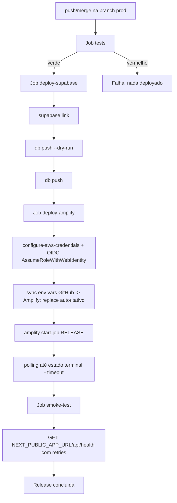

# Runbook — Pipeline de CI/CD de Produção (GitHub Actions + Supabase Cloud + AWS Amplify)

> **Escopo deste documento.** Runbook operacional **end-to-end** do release de produção da YAID
> (Epic 11, Sprint Change 2026-08-08). Cobre a arquitetura da pipeline, os quatro jobs, o setup manual
> one-time (bootstrap) versus os passos automáticos por release, o modelo de IAM least-privilege (com o
> JSON real das policies), o setup de custom domain, a política de migrations expand→contract, o
> procedimento de rollback e o troubleshooting (incluindo o checklist de hardening consolidado das
> Stories 11.1–11.6).
>
> Para o passo a passo específico de **desabilitar o Auto Build** do Amplify na branch `prod`, ver o
> documento complementar [`docs/ops/amplify-deploy.md`](../ops/amplify-deploy.md) — este runbook o
> referencia em vez de duplicá-lo.

---

## 1. Visão geral — modelo orquestrado

O release de produção **não** usa o auto-build do Amplify. Em vez disso, o **GitHub Actions é o
orquestrador** do release na branch `prod`, e o auto-build do Amplify nessa branch é **desabilitado**
para evitar dois deploys concorrentes. Todo push/merge em `prod` dispara uma pipeline determinística e
auditável com quatro gates sequenciais encadeados por `needs:`:

```
tests → deploy-supabase → deploy-amplify → smoke-test
```

- `tests` — roda a suíte como gate; nada é deployado se falhar.
- `deploy-supabase` — aplica migrations pendentes ao Supabase Cloud (com `--dry-run` antes).
- `deploy-amplify` — publica o app Next.js SSR no AWS Amplify (GitHub Actions OIDC + sync env + `start-job RELEASE`).
- `smoke-test` — valida a aplicação publicada via `GET /api/health`.

Migrations são aplicadas **antes** do deploy do app, seguindo **expand → deploy → contract**. A
autenticação AWS usa **GitHub Actions OIDC → `sts:AssumeRoleWithWebIdentity` → IAM Role de deploy**,
sem nenhuma credencial estática nem sessão a renovar manualmente. A validação pós-deploy é feita por
`GET /api/health` (endpoint público leve entregue pela Story 11.1,
[`app/api/health/route.ts`](../../app/api/health/route.ts)).

---

## 2. Arquitetura da pipeline

### 2.1 Estrutura distribuída

O usuário optou por uma pipeline **distribuída**: cada job vive em um **composite action** próprio em
`.github/jobs/<nome>/action.yml`, e o `.github/workflows/production.yml` é um orquestrador fino que
apenas os chama via `uses: ./.github/jobs/<nome>`.

> **Por que composite actions e não reusable workflows?** Reusable workflows do GitHub só podem morar em
> `.github/workflows/` (subpastas não são suportadas). Composite actions podem morar em qualquer pasta.
> Trade-off: composite actions recebem secrets via `with:` (inputs) a partir do orquestrador — os
> secrets ficam **centralizados** no `production.yml`, nunca hardcoded nos composites.

```
.github/
├── jobs/
│   ├── tests/action.yml
│   ├── deploy-supabase/action.yml
│   ├── deploy-amplify/action.yml
│   └── smoke-test/action.yml
└── workflows/
    └── production.yml        # 4 jobs finos (needs encadeados) que chamam os composites
```

### 2.2 Trigger e permissões

- **Trigger:** `on: push: branches: [prod]`. (A chave `on` é escrita como `"on"` entre aspas para
  evitar a coerção YAML 1.1 que a transformaria no booleano `true`.)
- **Permissões:** `permissions: contents: read` no nível do workflow — least-privilege; sem isso o
  `GITHUB_TOKEN` herdaria as permissões default (frequentemente amplas) do repositório/organização.
  O job `deploy-amplify` declara seu próprio bloco `permissions: {id-token: write, contents: read}`
  (ver §5) — no GitHub Actions, `permissions` no nível do job **substitui** (não mescla com) o default
  do workflow, por isso `contents: read` precisa ser repetido ali, senão o `actions/checkout` desse job
  perderia acesso de leitura ao repositório.
- **Secrets centralizados:** todos os secrets vivem no GitHub Environment/repo e são referenciados
  **apenas** no `production.yml`, passados aos composites via `with: ${{ secrets.* }}`. Nunca hardcoded.

### 2.3 Fluxo por release



---

## 3. Os quatro jobs

### 3.1 `tests` (gate) — [`.github/jobs/tests/action.yml`](../../.github/jobs/tests/action.yml)

Composite action que roda a suíte como gate:

1. `actions/setup-node@v4` com **Node 22 (LTS)** e cache npm.
2. `npm ci` (instalação determinística).
3. `npm test` (`node --test "tests/unit/**/*.test.mjs" && npm run test:dynamic`).

> **⚠️ Node 22 é obrigatório (§5.1).** `node --test` só expande o glob `**` (globstar) a partir do
> **Node 21+**. Em Node 18/20 o comando coletaria **zero** testes e passaria com um falso verde,
> tornando o gate inútil. Nunca use Node 18/20 aqui.

### 3.2 `deploy-supabase` — [`.github/jobs/deploy-supabase/action.yml`](../../.github/jobs/deploy-supabase/action.yml)

Aplica as migrations pendentes ao Supabase Cloud como **primeiro passo de infra** do release
(`needs: tests`):

1. `supabase/setup-cli@v1` instala a CLI.
2. `supabase link --project-ref … --password …` — conecta ao projeto Cloud.
3. `supabase db push --dry-run` — **preview** do diff (obrigatoriamente **antes** do apply).
4. `supabase db push` — **apply** das migrations.

**Inputs (secrets, via `with:`):** `supabase-access-token` (`SUPABASE_ACCESS_TOKEN`),
`supabase-project-ref` (`SUPABASE_PROJECT_REF`), `supabase-db-password` (`SUPABASE_DB_PASSWORD`).
Entram via `inputs` → `env`, **nunca** ecoados nos logs.

> A ordem `--dry-run` **antes** de `db push` é uma propriedade de segurança-chave (§5.5): prevê
> qualquer diff antes de aplicar. Ver §7 (migrations expand→contract).

### 3.3 `deploy-amplify` — [`.github/jobs/deploy-amplify/action.yml`](../../.github/jobs/deploy-amplify/action.yml)

Publica o app Next.js SSR no AWS Amplify (`needs: deploy-supabase`):

1. `aws-actions/configure-aws-credentials@v4` — autentica via **GitHub Actions OIDC**: o job declara
   `permissions: id-token: write` (precondição), o runner obtém o ID token OIDC do próprio job, e a
   action o troca diretamente pelo deploy role via `sts:AssumeRoleWithWebIdentity` (`role-to-assume`) —
   sem nenhuma credencial estática nem sessão a renovar manualmente (ver §5).
2. **Sync de env vars AUTORITATIVO** (Story 11.8 — reverte o modelo de merge da §5.4 da proposta
   2026-08-08): deriva os **nomes** do `.env.local.example` (ignora comentários/linhas vazias);
   resolve o **valor** de cada nome por colocação no GitHub — **Secrets primeiro, senão Variables**
   (`github-secrets-json`/`github-variables-json`, via `toJSON(secrets)`/`toJSON(vars)`); nomes sem
   valor em nenhum dos dois são **omitidos**; envia o mapa resolvido via
   `aws amplify update-branch --cli-input-json` como **replace total** do branch — **sem**
   `get-branch`/merge. Ver §6.2 para a tabela de classificação Variable vs Secret e o procedimento de
   adicionar uma variável nova.
3. `aws amplify start-job --job-type RELEASE` — dispara o deploy (auto-build desabilitado, Story 11.2).
4. **Polling finito** (§5.8): espera até estado terminal (60×15s = 15 min). `SUCCEED` → sucesso;
   `FAILED`/`CANCELLED`/inesperado/timeout → `exit 1`. Nunca um loop infinito.

**Inputs (secrets, via `with:`):** `aws-region`, `aws-role-to-assume` (`AWS_DEPLOY_ROLE_ARN`),
`amplify-app-id`, `amplify-branch-name`, `github-variables-json` (`${{ toJSON(vars) }}`),
`github-secrets-json` (`${{ toJSON(secrets) }}`). Nenhuma credencial estática é passada — a
autenticação é 100% OIDC. Nenhum secret server-side vira `NEXT_PUBLIC_*`; nada ecoado nos logs.

### 3.4 `smoke-test` (gate final) — [`.github/jobs/smoke-test/action.yml`](../../.github/jobs/smoke-test/action.yml)

Valida a aplicação publicada (`needs: deploy-amplify`):

- `curl -sS --max-time 15 -w '%{http_code}'` contra `$NEXT_PUBLIC_APP_URL/api/health`, com **retries
  finitos** (30×10s = 5 min).
- **Critério de sucesso (§6):** HTTP **200** e corpo casando `{"status":"ok"}` (reforço para não
  aprovar um health degradado). Ao esgotar as tentativas → `::error::` + `exit 1`.

**Input (via `with:`):** `production-url` (`NEXT_PUBLIC_APP_URL` — Variable do GitHub) — a URL de produção **nunca** é hardcoded;
vem do orquestrador. Não consome credenciais sensíveis.

---

## 4. Bootstrap (one-time manual) vs. Release (automático)

```mermaid
flowchart LR
    subgraph ONCE [Uma única vez - setup manual]
      S1[Supabase project + link]
      S2[Amplify app + conectar GitHub]
      S3[branch prod + desabilitar auto-build]
      S4[IAM OIDC provider + deploy role trust policy]
      S5[GitHub Environment secrets/vars]
      S6[Custom domain + DNS + SSL]
    end
    subgraph EACH [A cada release - automático]
      R1[tests]
      R2[db push --dry-run + db push]
      R3[OIDC AssumeRoleWithWebIdentity + sync env]
      R4[Amplify start-job RELEASE + wait]
      R5[smoke test /api/health]
    end
    ONCE -.pré-requisito.-> EACH
```



### 4.1 Setup one-time (manual) — checklist

Executado **uma vez** por um operador com acesso às contas (não faz parte da pipeline):

- [ ] **Supabase:** projeto Cloud criado; anotar o `project-ref`. (A pipeline faz `supabase link` a
      cada release, mas o projeto e a senha do banco precisam existir.)
- [ ] **Amplify app + GitHub:** criar o app Amplify e **conectar** ao repositório GitHub. Garantir que
      o app é do tipo **Web Compute (SSR)** — ver §8 (known-issues).
- [ ] **Branch `prod` + desabilitar auto-build:** criar a branch `prod` no Amplify e **desabilitar o
      Auto Build** nela. Passo a passo e verificação em
      [`docs/ops/amplify-deploy.md`](../ops/amplify-deploy.md).
- [ ] **IAM:** criar o **OIDC Identity Provider** do GitHub Actions
      (`token.actions.githubusercontent.com`) na conta AWS e o **deploy role** com a trust policy OIDC
      (`Principal.Federated` + `Condition` escopando o `sub` ao repo/branch) e a permission policy
      least-privilege (só ações do Amplify no ARN do app). JSON em §5. **Responsabilidade do humano** —
      fora do escopo do código deste repositório.
- [ ] **GitHub Environment:** cadastrar os **secrets/vars** (ver §6) no Environment/repo.
- [ ] **Custom domain + DNS + SSL:** associar o domínio, criar os registros DNS e provisionar o
      certificado SSL. Ver §6.

### 4.2 Por release (automático)

Disparado por push em `prod`; é exatamente a cadeia de §2/§3
(`tests → deploy-supabase → deploy-amplify → smoke-test`). Nenhuma ação manual é necessária num
release saudável.

---

## 5. IAM least-privilege (§5.7 — CRÍTICO)

A autenticação AWS usa **GitHub Actions OIDC puro** — sem nenhuma credencial estática nem sessão a
renovar manualmente:

```
GitHub Actions (ID token OIDC do job)  →  sts:AssumeRoleWithWebIdentity  →  deploy role (só ações do Amplify no ARN do app)
```

O job `deploy-amplify` declara `permissions: id-token: write` (+ `contents: read`, pois `permissions`
no nível do job **substitui** o default do workflow) — sem essa permissão o runner não emite o ID
token e `configure-aws-credentials` falha antes de qualquer chamada AWS. O deploy role confia
diretamente no OIDC Identity Provider do GitHub (`token.actions.githubusercontent.com`), com uma
`Condition` que escopa o `sub` ao repositório/branch — nunca `*`.

**Princípios:**

- Não existe usuário/credencial de longo prazo: o runner troca o ID token OIDC (de curta duração,
  emitido por release) diretamente pela sessão temporária do deploy role.
- O **deploy role** só tem as ações do Amplify estritamente usadas pela pipeline, escopadas ao **ARN do
  app**.
- **Proibido:** `AdministratorAccess`, `"Action": "*"`, `"Resource": "*"`, e `Principal`/`Condition`
  não-escopados (`*`) na trust policy.

**Responsabilidade do humano (fora do escopo de código):** criar o OIDC Identity Provider e aplicar a
trust policy abaixo ao deploy role na conta AWS. Enquanto isso não estiver feito, o
`sts:AssumeRoleWithWebIdentity` falha (`Not authorized`) e o job `deploy-amplify` não autentica.

Substitua os placeholders `<account-id>`, `<region>` e `<app-id>` pelos valores reais da sua conta.

### 5.1 Trust policy do deploy role (quem pode assumir via OIDC)

Anexada ao deploy role como *trust relationship*: só o GitHub Actions OIDC Identity Provider, para este
repositório executando na branch `prod`, pode assumi-lo via `AssumeRoleWithWebIdentity`:

```json
{
  "Version": "2012-10-17",
  "Statement": [{
    "Sid": "AllowGitHubActionsOIDC",
    "Effect": "Allow",
    "Principal": {"Federated": "arn:aws:iam::<account-id>:oidc-provider/token.actions.githubusercontent.com"},
    "Action": "sts:AssumeRoleWithWebIdentity",
    "Condition": {
      "StringEquals": {"token.actions.githubusercontent.com:aud": "sts.amazonaws.com"},
      "StringLike": {"token.actions.githubusercontent.com:sub": "repo:yaidEnterprise/yaid_dashboard:ref:refs/heads/prod"}
    }
  }]
}
```

> A `Condition` é o que impede qualquer outro repositório/branch (ou um fork) de assumir o deploy role
> — o `sub` do ID token OIDC só casa com pushes na branch `prod` deste repositório exato.

### 5.2 Permission policy do deploy role (só ações do Amplify, escopadas ao ARN do app)

Anexada ao deploy role. Contém **apenas** as ações do Amplify usadas pela pipeline
(`start-job`, `get-job`, `get-branch`, `update-branch`, `list-jobs`), escopadas ao ARN do app:

```json
{
  "Version": "2012-10-17",
  "Statement": [
    {
      "Sid": "AmplifyDeployLeastPrivilege",
      "Effect": "Allow",
      "Action": [
        "amplify:StartJob",
        "amplify:GetJob",
        "amplify:GetBranch",
        "amplify:UpdateBranch",
        "amplify:ListJobs"
      ],
      "Resource": [
        "arn:aws:amplify:<region>:<account-id>:apps/<app-id>",
        "arn:aws:amplify:<region>:<account-id>:apps/<app-id>/branches/prod",
        "arn:aws:amplify:<region>:<account-id>:apps/<app-id>/branches/prod/jobs/*"
      ]
    }
  ]
}
```

> **Auditoria:** nenhuma das duas policies (trust + permission) contém `AdministratorAccess`,
> `"Action": "*"` ou `"Resource": "*"`, e a trust policy nunca escopa `Principal`/`Condition` com `*`.
> Um teste estrutural (`tests/unit/story-11-7/`) parseia cada bloco JSON e afirma a ausência desses
> wildcards.

---

## 6. GitHub Environment — secrets e variables

Cadastre no GitHub Environment (ou repo) de produção. Referenciados **apenas** no `production.yml` e
passados aos composites via `with:`:

| Secret / Variable | Consumido por | Descrição |
|---|---|---|
| `SUPABASE_ACCESS_TOKEN` | deploy-supabase | Personal access token da CLI Supabase |
| `SUPABASE_PROJECT_REF` | deploy-supabase | Project-ref do projeto Cloud |
| `SUPABASE_DB_PASSWORD` | deploy-supabase | Senha do Postgres (link/db push) |
| `AWS_REGION` | deploy-amplify | Região do app Amplify (ex.: `us-east-1`) |
| `AWS_DEPLOY_ROLE_ARN` | deploy-amplify | ARN do deploy role a assumir |
| `AMPLIFY_APP_ID` | deploy-amplify | ID do app Amplify |
| todas as **Variables** e **Secrets** listadas em §6.2 | deploy-amplify | Env vars server-side da app, sincronizadas de forma autoritativa (§3.3 e §6.2) |

> **Nota:** o smoke-test reutiliza a Variable `NEXT_PUBLIC_APP_URL` (já listada em §6.2) — não há secret/variable separado `PRODUCTION_URL`.

> **Não há credencial AWS estática cadastrada:** a autenticação usa exclusivamente GitHub Actions OIDC
> (`sts:AssumeRoleWithWebIdentity`, ver §5) — nenhum secret de access key/secret key/session token de
> longo prazo é cadastrado ou consumido por este repositório.

> **Não é secret:** `amplify-branch-name` (nome do branch a publicar) vem de `github.ref_name` — o
> branch que disparou o workflow (`on.push.branches: [prod]`) — e não de um secret/variable
> separado, já que é sempre igual ao branch da própria pipeline.

> **Env obrigatórias com `STAGE=PROD` (§5.3 da proposta):** `environments.ts` valida no boot
> `ISSUER_PRIVATE_KEY`, `WEBHOOK_SIGNING_PRIVATE_KEY`, `BLOCKCHAIN_WALLET_PRIVATE_KEY`,
> `BLOCKCHAIN_CONTRACT_ADDRESS` quando `STAGE=PROD`. Todas devem existir como Secret/Variable do GitHub
> (§6.2), senão a app quebra no boot. Secrets server-side **nunca** viram `NEXT_PUBLIC_*`.

### 6.2 Sync de env vars no Amplify — modelo autoritativo (Story 11.8)

> **Reverte o modelo de MERGE da §5.4 da proposta 2026-08-08.** O merge dependia de um único secret
> manual (`AMPLIFY_ENVIRONMENT_VARIABLES`) desacoplado do `.env.local.example`/`environments.ts` —
> variáveis novas nunca chegavam ao Amplify sem edição manual desse payload. O modelo autoritativo
> resolve isso: a lista de **nomes** vem do `.env.local.example` (fonte única de verdade de **quais**
> variáveis existem); os **valores** vêm do GitHub (Secrets/Variables) pela colocação.

**Como funciona:**

1. O step de sync lê o `.env.local.example` do repo checado e extrai os **nomes** (ignora comentários
   `#` e linhas vazias).
2. Para cada nome, resolve o **valor**: primeiro em `github-secrets-json` (`${{ toJSON(secrets) }}`),
   senão em `github-variables-json` (`${{ toJSON(vars) }}`). Um nome sem valor em nenhum dos dois é
   **omitido** do payload — não vira `""` nem quebra o step.
3. O mapa resolvido é enviado via `aws amplify update-branch --cli-input-json` como **replace total**
   do branch — **sem** `get-branch` nem merge. Isso é seguro porque, neste modelo, toda env var usada
   pela app tem origem no GitHub (Variables/Secrets); nenhuma variável server-side vive apenas no
   console do Amplify.

**Regra de colocação (Secret vs Variable):** nome contém `KEY`, `PASSWORD`, `PRIVATE`, `SECRET` ou
`TOKEN` → **Secret**; senão → **Variable**. Duas exceções documentadas:
`NEXT_PUBLIC_SUPABASE_PUBLISHABLE_KEY` → **Variable** (é pública, embutida no bundle client-side
mesmo); `BLOCKCHAIN_RPC_URL` → **Secret** (embute a API key do provedor de RPC na URL — a URL inteira é
sensível, não pode ficar em texto plano numa Variable).

**`STAGE` não é cadastrado no GitHub (nem Secret nem Variable):** o sync deriva `STAGE` automaticamente
do branch publicado (upper-case de `AMPLIFY_BRANCH_NAME`, que por sua vez vem de `github.ref_name`) —
como esta pipeline só dispara em `prod` (`on.push.branches: [prod]`), `STAGE` é sempre `PROD`. O nome
continua listado no `.env.local.example` (documenta que a app lê `STAGE`), mas o step de sync nunca
consulta Secrets/Variables para ele.

**Classificação atual (12 nomes cadastráveis, derivados do `.env.local.example`; `STAGE` é o 13º nome
mas é automático — ver acima):**

| GitHub Variables (4) | GitHub Secrets (8) |
|---|---|
| `NEXT_PUBLIC_APP_URL` | `SUPABASE_SECRET_KEY` |
| `NEXT_PUBLIC_SUPABASE_URL` | `SUPABASE_DB_PASSWORD` |
| `NEXT_PUBLIC_SUPABASE_PUBLISHABLE_KEY` | `BLOCKCHAIN_RPC_URL` |
| `BLOCKCHAIN_CONTRACT_ADDRESS` | `BLOCKCHAIN_WALLET_PRIVATE_KEY` |
| | `ISSUER_PRIVATE_KEY` |
| | `WEBHOOK_SIGNING_PRIVATE_KEY` |
| | `MISTRAL_API_KEY` |

> `YAID_VERIFICATION_BASE_URL` **não** consta nessa lista e **não existe mais** como getter em
> `environments.ts`: a URL de verificação é derivada inline em
> `create_proof_request_usecase.ts` como `` `${env.NEXT_PUBLIC_APP_URL}/v/${token}` ``
> (Sprint Change 2026-08-09) — não é lida de `process.env` nem precisa de Secret/Variable próprio.

**Como criar uma Variable ou um Secret no GitHub** (Settings do repo, ou do Environment de produção se
usar Environments):

- **Variable:** `Settings → Secrets and variables → Actions → Variables tab → New repository variable`
  (ou *New environment variable*, dentro do Environment). Nome e valor em texto plano — aparece nos
  logs se ecoado (mas o composite nunca ecoa).
- **Secret:** `Settings → Secrets and variables → Actions → Secrets tab → New repository secret` (ou
  *New environment secret*). Valor mascarado nos logs pelo próprio GitHub; não pode ser lido de volta
  pela UI depois de salvo.

**Procedimento para adicionar uma env var nova:**

1. Adicione o nome ao `.env.local.example` (com um placeholder de valor, ex.:
   `NOVA_VAR=YOUR_NOVA_VAR`) — isso a torna elegível para o sync automaticamente, sem tocar no
   composite/workflow.
2. Classifique conforme a regra de colocação acima e crie o **Secret** ou a **Variable**
   correspondente no GitHub com o mesmo nome exato.
3. No próximo release em `prod`, o step de sync já a inclui no payload do `update-branch` — nenhuma
   mudança de código é necessária em `.github/jobs/deploy-amplify/action.yml`.
4. Se a variável for obrigatória no boot com `STAGE=PROD` (ex.: um novo secret exigido por
   `environments.ts`), garanta que o Secret/Variable existe **antes** do release — a app falha
   fail-fast no boot se faltar.

### 6.3 Custom domain + DNS + SSL

Setup one-time do domínio customizado no Amplify:

1. **Associar o domínio no Amplify:** Amplify Console → App → *Domain management* → *Add domain*.
   Informe o domínio raiz (ex.: `exemplo.com`) e o subdomínio desejado (ex.: `app`), mapeando-o para a
   branch `prod`.
2. **Registros DNS:** o Amplify fornece os registros a criar no seu provedor DNS:
   - Um registro **CNAME** (ou **ANAME/ALIAS** para o apex) apontando o subdomínio para o domínio de
     hospedagem do Amplify (`*.amplifyapp.com` / o alvo indicado pelo Console).
   - Registro(s) **CNAME de verificação** (ACM) para validar a posse do domínio e emitir o certificado.
3. **SSL/TLS:** o Amplify provisiona e renova automaticamente um certificado gerenciado (AWS
   Certificate Manager) após a validação DNS. O status fica *Available* quando o SSL está ativo.
4. **Verificação:** aguardar a propagação DNS, confirmar o cadeado HTTPS e que
   `https://<seu-dominio>/api/health` responde `200 {status:"ok"}`. Defina a Variable `NEXT_PUBLIC_APP_URL`
   para essa URL — o smoke-test a reutiliza (não há secret/variable `PRODUCTION_URL` separado).

---

## 7. Migrations — expand → contract

A pipeline aplica migrations **antes** do deploy do app, com `db push --dry-run` antes do apply. Para
não quebrar a app em produção durante o deploy, siga o padrão **expand → deploy → contract**:

1. **Expand (compatível para trás):** adicione estruturas novas (colunas/tabelas nullable, novos
   índices) sem remover as antigas. A migration entra no release; o app novo e o antigo funcionam com o
   schema expandido.
2. **Deploy:** o app novo (que usa a estrutura nova) é publicado.
3. **Contract (destrutivo):** só **depois** que o app publicado deixou de depender da estrutura antiga,
   um release **posterior** remove o que ficou obsoleto (`DROP COLUMN`, etc.).

> **Nunca** faça uma migration destrutiva no mesmo release que ainda depende da estrutura antiga — o
> curto intervalo entre `db push` e o Amplify `SUCCEED` rodaria o app velho contra o schema já reduzido.

**Baseline atual:** `supabase/migrations/20260728015653_remote_schema.sql` é um dump de `db pull` já
refletido no remoto, então o primeiro `db push` deve ser **no-op**. O `--dry-run` confirma isso antes
do apply.

---

## 8. Rollback

### 8.1 Rollback do app (Amplify)

- **Opção A — redeploy de um job anterior:** no Amplify Console → App → branch `prod` → histórico de
  deploys, promova/redeploy o último job `SUCCEED` conhecido. Como o auto-build está desabilitado, o
  estado publicado só muda por ação explícita.
- **Opção B — revert do commit em `prod`:** faça `git revert` do commit problemático (ou um push do
  commit bom anterior) na branch `prod`. Isso dispara a pipeline completa novamente
  (`tests → deploy-supabase → deploy-amplify → smoke-test`), republicando o app são. Preferível quando
  o problema está no código.
- Em ambos os casos, o `smoke-test` valida o `/api/health` após o rollback.

### 8.2 Rollback de banco (implicação do expand→contract)

- Rollback de app é seguro **desde que** as migrations tenham sido **expand-only** (compatíveis para
  trás): o app antigo continua funcionando com o schema expandido. Este é o principal motivo de adiar
  as migrations destrutivas (contract) para depois.
- Se uma migration destrutiva já foi aplicada, um rollback de app pode não bastar — será necessária uma
  **forward migration** de compensação (Supabase/Postgres não faz rollback automático de `db push`).
  Planeje o contract para um release separado justamente para preservar a reversibilidade.

---

## 9. Troubleshooting / Known-issues & checklist de hardening (consolidado das Stories 11.1–11.6)

Esta seção consolida, como **checks operacionais e known-issues**, os itens deferidos durante o Epic 11
(ver `_bmad-output/implementation-artifacts/deferred-work.md`). Vários exigem acesso real a AWS/GitHub e
não puderam ser exercitados no sandbox — trate-os como itens de verificação no primeiro release real.

### 9.1 Supply-chain — SHA-pinning das GitHub Actions

- **Known-issue:** hoje as actions são referenciadas por tag de major mutável — `actions/checkout@v4`,
  `actions/setup-node@v4`, `aws-actions/configure-aws-credentials@v4`. Tags de major apontam para o head
  da major version; em tese uma atualização maliciosa da action rodaria no CI sem mudança no repo.
- **Recomendação (hardening):** fixar por **commit SHA** (`actions/checkout@<sha>  # v4.x.x`) em todos
  os composites e no `production.yml`. Estabelecer isso como **política de pinning** de toda a pipeline
  de uma vez. Renovar os SHAs via Dependabot/renovate ao atualizar versões.

### 9.2 `supabase/setup-cli` com `version: latest`

- **Known-issue:** `deploy-supabase` usa `supabase/setup-cli@v1` com `version: latest` — a versão da CLI
  instalada não é determinística entre releases; uma mudança de comportamento poderia alterar `db push`
  sem aviso.
- **Recomendação:** **pinar uma versão específica** da Supabase CLI (`version: <x.y.z>`) e o SHA da
  action, junto com o SHA-pinning de §9.1.

### 9.3 `db push` pode exigir confirmação interativa em CI não-TTY

- **Known-issue:** historicamente a CLI pergunta *"Do you want to push these migrations…?"*; em runner
  não interativo (não-TTY) isso pode falhar/travar. Não reproduzível no sandbox.
- **Verificar no primeiro release real:** se o step de apply travar/pedir confirmação, adicionar a flag
  não-interativa/auto-confirm apropriada da versão pinada da CLI ao step `supabase db push`.

### 9.4 Amplify App precisa ser "Web Compute" (SSR) no nível do App

- **Known-issue crítico:** `amplify.yml` correto (`baseDirectory: .next`) **não** basta — se o App
  Amplify tiver sido detectado/criado como **site estático**, rotas SSR/middleware retornam 404.
- **Verificar (one-time):** confirmar no Amplify Console que a plataforma do App é **Web Compute (SSR)**,
  não *Static*. Se estiver como estático, recriar/reconfigurar o App como Web Compute. O app tem 24+
  rotas `app/api/*` + middleware — é SSR, não static export.

### 9.5 Verificar que o Auto Build foi de fato desabilitado

- **Known-issue:** o repositório documenta a ação de desabilitar o Auto Build, mas nada verifica
  automaticamente que ela foi executada na conta AWS. Se o Auto Build continuar ativo na `prod`, cada
  push causaria **dois** deploys (o do Amplify + o orquestrado pela pipeline).
- **Verificar (one-time):** seguir a seção *Verificação* de
  [`docs/ops/amplify-deploy.md`](../ops/amplify-deploy.md) (Console ou
  `aws amplify get-branch … --query 'branch.enableAutoBuild'` deve retornar `false`).

### 9.6 Sync de env vars — validação do payload JSON

- **Known-issue:** o step de sync consulta `$SECRETS_JSON`/`$VARS_JSON` via `jq -r --arg n "$name"`;
  se `github-secrets-json`/`github-variables-json` não forem JSON válido, o step aborta **sem mensagem
  dedicada**.
- **Recomendação:** validar os dois payloads (ex.: `jq empty <<<"$SECRETS_JSON"` /
  `jq empty <<<"$VARS_JSON"`) com uma mensagem explícita ("payload de Secrets/Variables inválido")
  antes de resolver os valores. Fail-fast é aceitável, mas a mensagem facilita o diagnóstico. Lembre:
  o modelo é **replace autoritativo** (Story 11.8) — não há mais `current`/merge a preservar; um nome
  que não existir no `.env.local.example` simplesmente não entra no payload.

### 9.7 Tolerância a erros transitórios (polling do Amplify / retries do smoke-test)

- **Known-issue:** o polling do Amplify (`aws amplify get-job`) roda sob `set -euo pipefail`; uma única
  falha de rede aborta a espera inteira. O smoke-test retenta uniformemente qualquer falha e, se
  `NEXT_PUBLIC_APP_URL` vier vazio/malformado, só falha após esgotar as 30 tentativas sem mensagem dedicada.
- **Recomendação:** avaliar retry/backoff **tolerante a erros transitórios** no `get-job` (mantendo o
  loop finito e o timeout total), e uma **validação explícita da `NEXT_PUBLIC_APP_URL`** + distinção entre
  erro transitório e app genuinamente fora do ar no smoke-test. Não reproduzível no sandbox.

### 9.8 Health check e middleware

- `middleware.ts` intercepta `/api/*`; `/api/health` está liberado como rota pública (`isPublicApiRoute`)
  pela Story 11.1 para que o smoke-test não seja bloqueado por sessão. O endpoint responde
  `200 {status:"ok"}`, `force-dynamic`, `Cache-Control: no-store`, sem DB nem secrets.

### 9.9 Falhas comuns por job (diagnóstico rápido)

| Sintoma | Job | Causa provável / ação |
|---|---|---|
| Suíte "passa" com 0 testes coletados | tests | Node < 21 no runner — garantir Node 22 (§3.1) |
| `db push` trava/pede confirmação | deploy-supabase | CI não-TTY (§9.3) — flag não-interativa |
| `db push` aplica algo inesperado | deploy-supabase | revisar o `--dry-run` antes; migration destrutiva fora de ordem (§7) |
| `Not authorized to perform sts:AssumeRoleWithWebIdentity` / `AccessDenied` na AWS | deploy-amplify | OIDC Identity Provider/trust policy do deploy role ainda não configurados na conta AWS, ou ARN/condição do `sub` errados (§5) |
| `configure-aws-credentials` falha ao obter o ID token OIDC | deploy-amplify | `permissions: id-token: write` ausente/incorreta no job (ver `production.yml`) |
| Env vars server-side sumiram/erradas | deploy-amplify | nome ausente do `.env.local.example`, ou Secret/Variable correspondente não cadastrada no GitHub (§6.2) |
| Deploy nunca termina | deploy-amplify | polling atinge timeout (15 min) → `exit 1`; checar o job no Console |
| 404 em rotas SSR após deploy | deploy-amplify | App não é Web Compute (§9.4) |
| smoke-test falha após 5 min | smoke-test | app fora do ar, `NEXT_PUBLIC_APP_URL` errada, ou cold start > 5 min (§9.7) |

---

## 10. Referências

- [`docs/ops/amplify-deploy.md`](../ops/amplify-deploy.md) — desabilitar o Auto Build na branch `prod`
  (passo a passo Console/CLI + verificação).
- [`app/api/health/route.ts`](../../app/api/health/route.ts) — endpoint público alvo do smoke-test
  (Story 11.1).
- [`.github/workflows/production.yml`](../../.github/workflows/production.yml) — orquestrador.
- [`.github/jobs/tests/action.yml`](../../.github/jobs/tests/action.yml),
  [`.github/jobs/deploy-supabase/action.yml`](../../.github/jobs/deploy-supabase/action.yml),
  [`.github/jobs/deploy-amplify/action.yml`](../../.github/jobs/deploy-amplify/action.yml),
  [`.github/jobs/smoke-test/action.yml`](../../.github/jobs/smoke-test/action.yml) — os 4 composites.
- [`amplify.yml`](../../amplify.yml) — build spec SSR (`npm ci` + `next build`, `baseDirectory: .next`).
- `_bmad-output/planning-artifacts/sprint-change-proposal-2026-08-08.md` — plano autoritativo do Epic 11.
- `_bmad-output/implementation-artifacts/deferred-work.md` — itens de hardening consolidados na §9.
